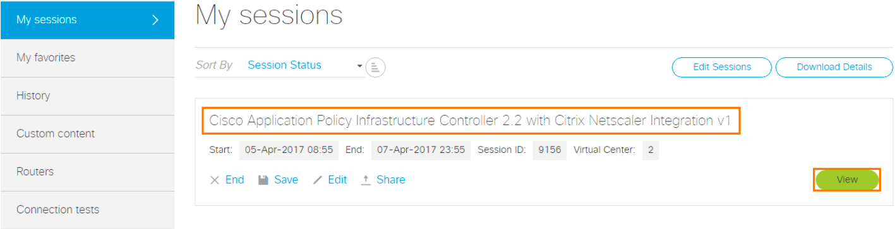
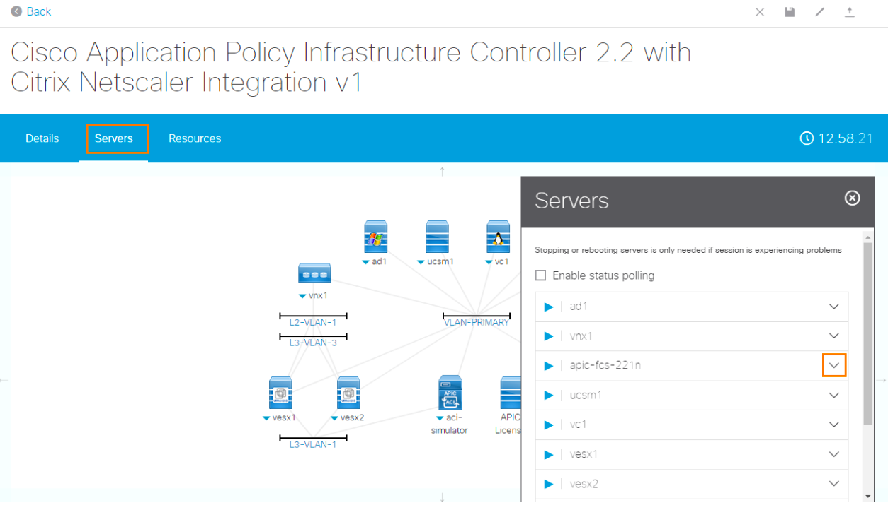
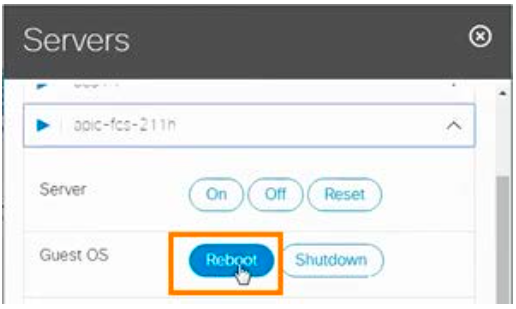
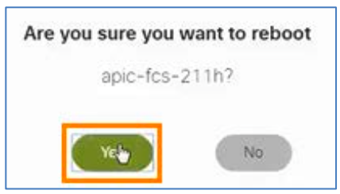

# Appendix A. Reset APIC Simulator 

APIC Fabric Members are created by default, so that the demonstration can begin with the creation of the APIC objects. To demonstrate the fabric discovery, reboot the apic-fcs via Guest OS Control as follows:

## Steps 

1. From the dCloud Demo Dashboard, click the View button for this demo.
  
  

2. On the Demo menu, click **Servers**.

3. In the Servers list, click the **down arrow** next to `apic-fcs-211h`.
  
  

4. Click **Reboot** 
  
   

5. Click **Yes** in the resulting pop-up.
  
  

> NOTE: It will take up to 5 minutes before you can login and rebuild the Fabric using one of the Fabric Discovery methods in [Appendix B](../Appendix-B).

