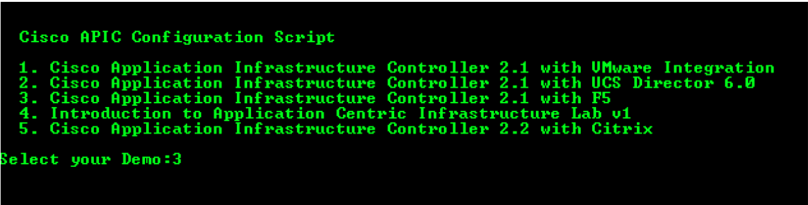
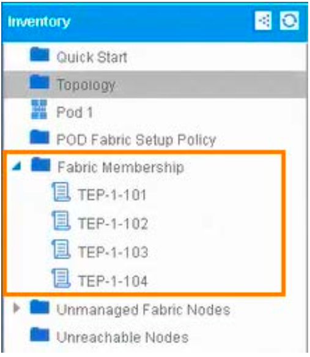
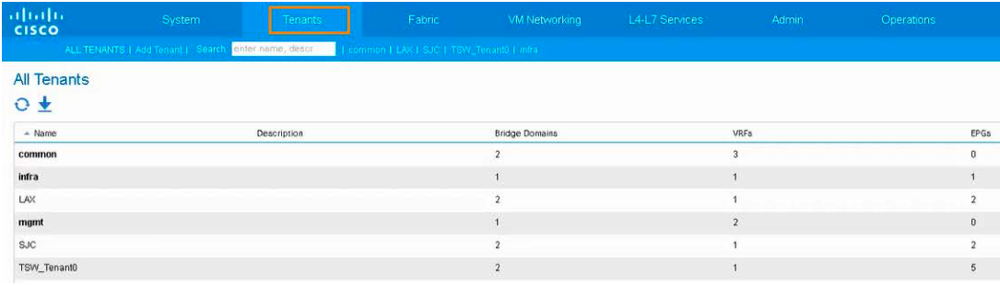

# Appendix B. Fabric Discovery

Follow the steps below to discover the ACI Fabric.

> NOTE: The full fabric discovery can take up to 15 minutes. The apic3 controller will be discovered after all the devices are discovered. You can check monitor the progress by selecting Topology from the Inventory pane in the APIC GUI. While the discovery is taking place, you can complete [Scenario 1](../../Scenario1), which ends in the APIC Topology window showing the discovered elements.

## Steps 

### Configure APIC Fabric Using Scripts

1. Log in to APIC (**admin/C1sco12345/Advanced**). If there is an error message, wait a few minutes for Fabric Discovery to complete. Click **OK** on any error messages.

2. Click **Fabric** in the top menu.

3. Click **Inventory** in the submenu.

4. Click **Topology**  in the Navigation pane.

  

5. From the Demonstration workshop desktop, double-click the **Build ACI Fabric** icon. This script turns the APIC Fabric to the state it was in at the start of the demo. 

6. Type **5 < Enter >** at the **Select your Demo**: prompt. The script will begin building the fabric, which will take about 15 minutes.

  

7. The script will begin building the F5, which will complete before the ACI fabric is set up. Wait for the **Waiting for 0 seconds, press any key to continue** notification, then wait five minutes before proceeding.

8. Expand Fabric Membership in the navigation pane and show that the spines and leafs are now present in the APIC.

  

9. Click **Tenants** in the top menu and show that all of the required tenants are present.

  
