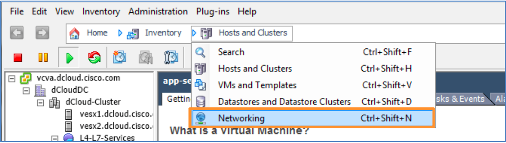
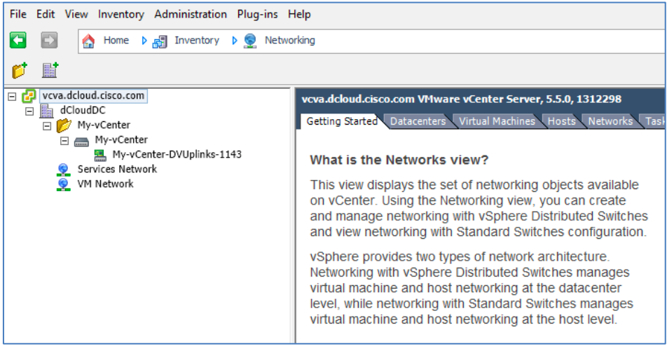
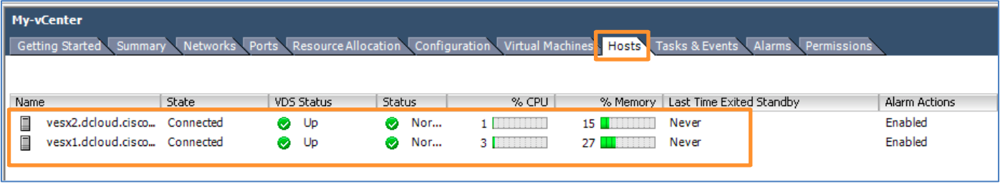

# Appendix C. Add VMware Hosts to APIC DVS Manually

Use the vSphere client to add the Hosts as follows:

## Steps

1. Start vSphere from the Task Bar by clicking the icon, and make sure the **Use Windows Credentials** checkbox is
checked. Click **Login**.

2. Click **Hosts and Clusters** in the Location bar to open the drop-down menu.

3. Choose **Networking** from the menu.

  

4. Expand **vcva.dcloud.cisco.com > dCloudDC > My-vCenter** to verify that the APIC is connected to the VMware vCenter Server.

5. Expand the **My-vCenter directory** tree to show the uplink.

  

6. Click **My-vCenter** to display the Getting Started page.

7.  Click **Add a host**.

8. In the **Add Host to vSphere Distributed Switch** wizard, select **vmnic2** as the target physical adapter for each switch and click **Next**.

  

9. Click **Next** to the end of the wizard, then click **Finish**.

10. Monitor the status of the host creation in the Recent Tasks bar until the Status column shows **Completed**.

11. Click the **Hosts** tab to see that the new hosts have been enabled.

  

  > **NOTE**: There may be a warning icon in the Status column. This can be ignored.

12. Return to the appropriate script and continue:
  
  *	If performing Scenario 2, add the [Physical Domain](Place-holder).
  *	If performing Scenario 3, add the [Device Packages](Place-holder).
  

