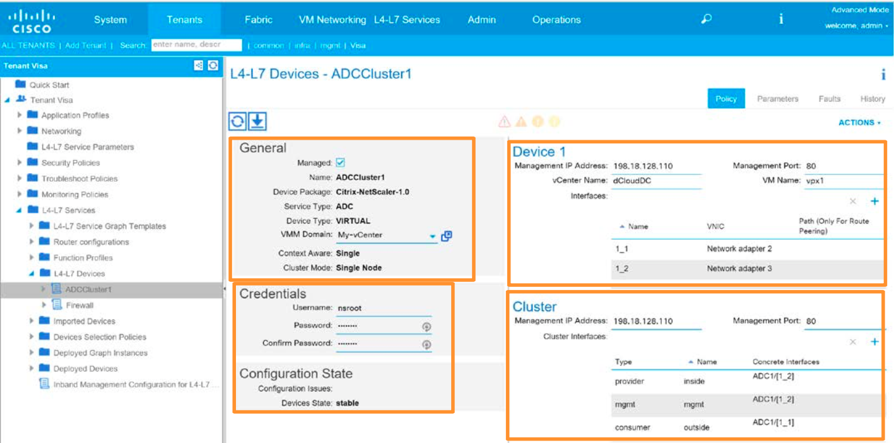

# Appendix D. Create a Device Cluster

This procedure replaces three scripts in the automated procedure:
  * `CreateLDevVip.xml`
  * `CreateCDev.xml`
  * `CreateLIf.xml`

## Steps 

1. In the APIC window, select **Tenants** from the top menu.

2. Select the target area: **Visa**

3. Expand the **L4-L7 Services > L4-L7 Devices** hierarchy, which is empty.	

4. Right-click **L4-L7 Devices** and select **Create L4-L7 Devices** from the menu.

5. Enter the Device parameters as follows. Click **Next**.
   > **Note:** that all parameters are case sensitive.B
  
    | **Parameter** | **Scenerio 2** | **Scenario 3 – NetScaler** | **Scenario 3 – ASA** |
    :---: | --- | --- | ---
    **Tenant Where Cluster Is Created** | Visa | Visa | Visa
    **Name** | ADCCluster1 | ADCCluster1 | Firewall
    **Service Type** | ADC | ADC | Firewall
    **Device Type** | VIRTUAL | VIRTUAL | VIRTUAL
    **VMM Domain** | My-vCenter | My-vCenter | My-vCenter
    **Mode** | Single Node | Single Node | Single Node
    **Device Package** | Citrix-NetScaler-1.0 | Citrix-NetScaler-1.0 | CISCO-ASA-1.2
    **Model** | NetScaler-VPX | NetScaler-VPX | ASAv
    **Function Type** | n/a | n/a | GoTo
    **Connectivity** | Out-Of-Band | Out-Of-Band | Out-Of-Band
    **Username** | nsroot | nsroot | admin
    **Password/Confirm Password** | C1sco12345 | C1sco12345 | C1sco12345
    **Management IP Address (Device 1 and Cluster)** | 198.18.128.110 | 198.18.128.110 | 198.18.128.110
    **Management Port** | http | http | https
    **VM** | dCloudDC/vpx1 | dCloudDC/vpx1 | dCloudDC/ASAv

6. Add the **Device Interfaces** by clicking the **+** and entering the following parameters. 
   > **Note:** that all parameters are case sensitive.
  
    | **Scenario/Device** | **Interface Name** | **VNic** 
    :---: | --- | --- 
    **Scenario 2/ADCCluster1** | 1_1 | Network Adapter 2
    **Scenario 2/ADCCluster1** | 1_2 | Network Adapter 3
    **Scenario 3/ADCCluster1** | 1_1 | Network Adapter 2
    **Scenario 3/ADCCluster1** | 1_2 | Network Adapter 3
    **Scenario 3/Firewall** | Gigabit Ethernet 0/0 | Network Adapter 2
    **Scenario 3/Firewall** | Gigabit Ethernet 0/1| Network Adapter 3
  
7. Add the **Cluster Interfaces** by clicking the + and entering the details below for 1st and 2nd interfaces. Click **Next**.

    | **Scenario/Device** | **Type** | **Name** | **Concrete Interfaces** |
    :---: | --- | --- | ---
    **Scenario 2/ADCCluster1** | Provider | inside | `Device1/1_2`
    **Scenario 2/ADCCluster1** | Mgmt. | mgmt | `Device1/1_2`
    **Scenario 2/ADCCluster1** | Consumer | outside | `Device1/1_1`
    **Scenario 3/ADCCluster1** | Provider | inside | `Device1/1_2`
    **Scenario 3/ADCCluster1** | Mgmt. | mgmt | `Device1/1_2`
    **Scenario 3/ADCCluster1** | Consumer | outside | `Device1/1_1`
    **Scenario 3/Firewall** | Provider | inside | `Device1/GigabitEthernet0/1`
    **Scenario 3/Firewall** | Consumer | outside | `Device1/GigabitEthernet0/1`

 8. Click **Next** through all the screens in the Parameters tab. Do not make any changes.

 9. Click **Finish**.

 10. Review the parameters of the newly created Device Cluster. The figure below shows an example. Make sure you have configured all the highlighted sections.
   
   

 11. Return to the appropriate scenario:
  
  * If you are performing **Scenario 2**, [click here](../../Scenario2).
  * If you are performing **Scenario 3**, [click here](../../Scenario3).

