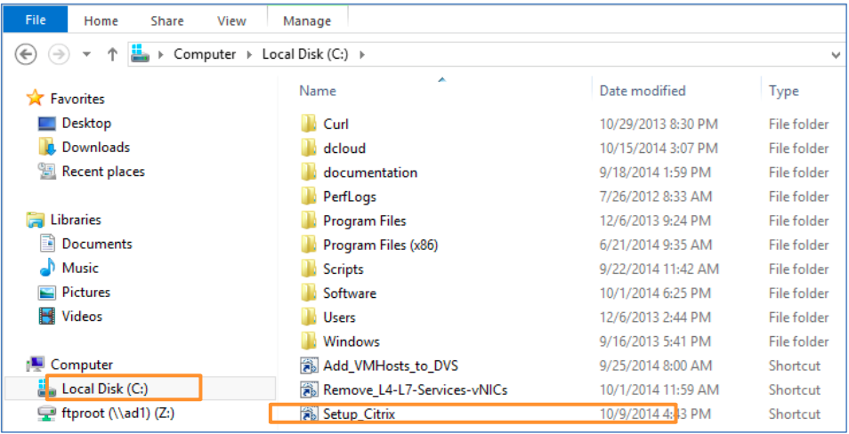

# Appendix F. Add the Citrix vpx1 VM

## Steps

1. Click **Windows Explorer** in the wkst1 taskbar.

2. Click **Local Disk (C:)** in the Navigation Pane.

3. Double-click **Setup_Citrix** to run the vpx1 setup script.
  
  

4. Return to the appropriate scenario:

  * [Scenario 1](../../Scenario1): APIC System Health & Topology
  * [Scenario 2](../../Scenario2): Multi-Tenant with Multiple Graphs via the Northbound API
  * [Scenario 3](../../Scenario3): Single-Tenant, Single-Graph with Multiple Nodes