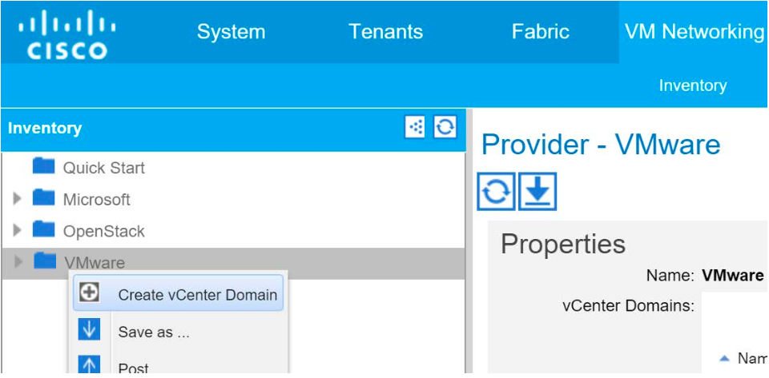
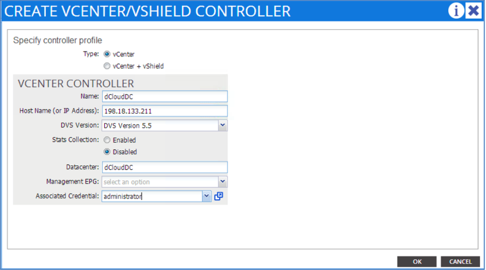
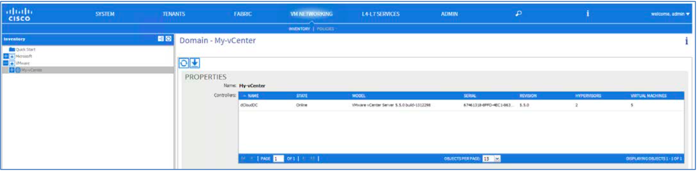

# Appendix G. Create VMM Domain

## Steps 

1. On the top menu of the APIC window, select **VM NETWORKING**.

2. Then under the sub-menu, click **Inventory**.

3. On the left-hand panel, select **VMware**.

4. Then on the right-hand panel, click **ACTIONS**.

5. Then select **Create vCenter Domain**.
  
  

6. In the **Name** window box, type **My-vCenter**.

7. In the **VLAN Pool** window, click the drop-down arrow.

8. Select **webService(dynamic)**.

9. Create the credentials to login to the vCenter server by clicking the **+** next to the **vCenter Credentials**.

10. In the **Name** window, type **administrator**.

11. In the **Username** box, type **administrator**.

12. In the **Password**: window, type **C1sco12345**.

13. In the **Confirm Password** window, retype the password.

14. Click **OK** to complete the task.

15. Create the vCenter server object by clicking the **+** next to **vCenter/vShield**.
  
  
  
  > **Note**: NOTE: Within this **Create vCenter Domain** task, it is important to enter in the information EXACTLY as shown below.

16. Make sure the **vCenter** button is selected.

17. In the **Name** window, type **dCloudDC**.

18. In the **Address**, type **198.18.133.211**.

19. In the **DVS Version**, select **DVS Version 5.5** from the drop down.

20. In the **Datacenter** window, type **dCloudDC**.

21. In the **Associated Credential** drop-down menu, select the credential object that was created in the previous task: **administrator**.

22. Click **OK**.
  
  

23. Add the VM Hosts to APIC DVS manually. Refere to [Appendix C](../Appendix-C)
