# Scenario 1. APIC System Overview and Operations #

This scenario provides an overview of the APIC System Health dashboard and how to drill down into a health score to identify a root issue.

## Steps ##

1. From the demo workstation, open **Application Policy Infrastructure Controller** (if it is not already open) by clicking the **APIC Login** icon , and login (**admin/C1sco12345/Advanced**).

2. Click **NO** on the Warning pop-up.

	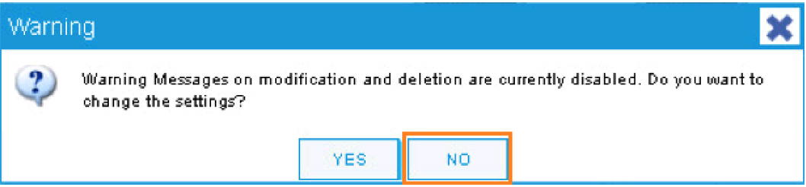

3. Click **Tenants** in the top menu, then click **common** in the sub menu.

4. Point out the sections of the APIC dashboard.

	* The top of the GUI screen is the Menu bar tab.
	* The middle of the GUI is the Submenu bar tab.
	* The bottom left of the GUI screen is the Navigation Pane.
	* The middle-right of the GUI is the Work Pane.
	* The menu bar within the work pane shows the Tabs.

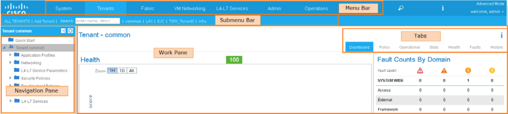

### System Health Dashboard ###

1. From the menu bar, click **System** to display the **System Health Dashboard**.
  
    * Explain that you logged in with global administrative rights and your view includes   all system components.
    * Show the single-pane view, which provides a centralized, application-level  visibility with real-time application health monitoring across the physical and  virtual environments.
    * Show the health scores and explain how a health score is displayed for components   that are being monitored by APIC, such as:
    	* Fabric health
    	* Connections to virtual and physical environments
    * Show that the left pane contains health scores for the overall system as well as  specific components.
    * Show that the right pane contains fault counts based on areas that have errors.
    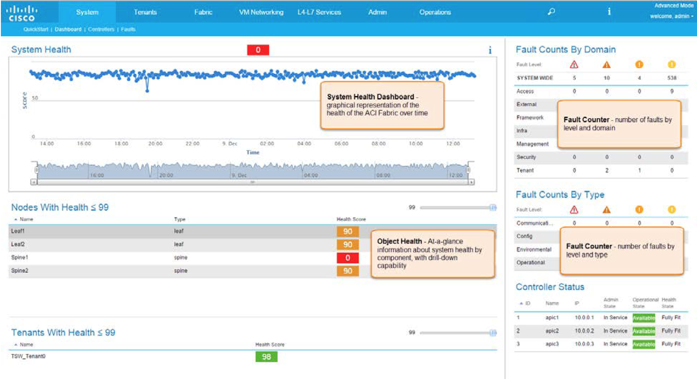

2. Double-click **Leaf1**, which has a health score of 90.

3. In the Leaf1 window, click the **Health** tab and scroll down until the element with a health score of 90 or lower becomes visible.
  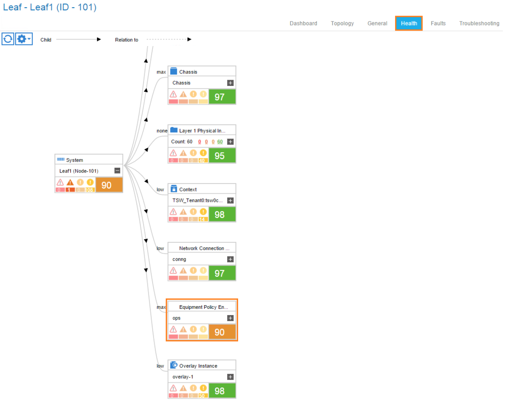

4. Click the + sign to expand the Equipment Policy to view the Power Supply that is showing a fault.
  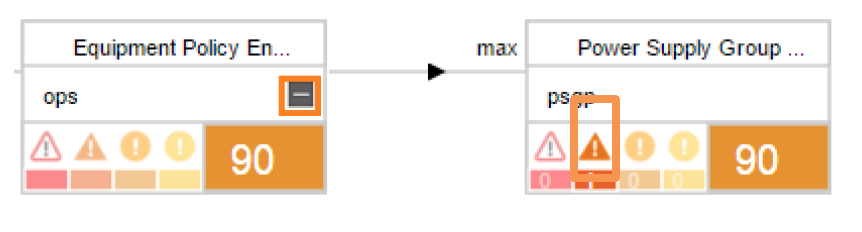
 
5. Right-click the Power Supply Group and click Show Faults in the resulting menu.
  
 
6. Examine the resulting table, which shows the details of the fault.
  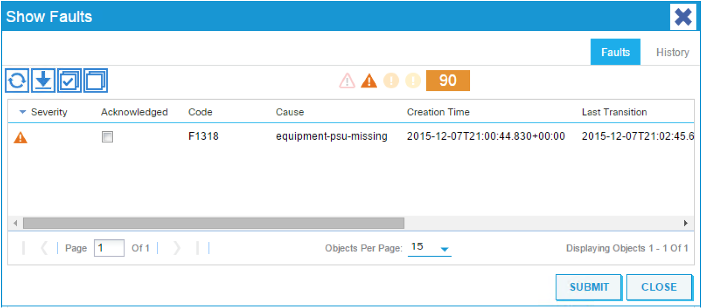

7. Close the **Show Fault**s window.

### Visibility & Troubleshooting ###

1. Click **Operations** to get to the Troubleshooting Wizard View.
  

2. In the Session Name field, type **tsw_session1**.

3. In the Description field, type **Troubleshooting Session 1**.

4. In the Source field, type the source IP address: **10.193.101.14** and click **Search**. Click the result.

5. In the Destination field, type the destination IP address: **10.193.102.17** and click **Search**. Click the result.
  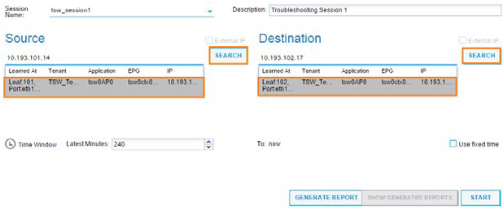
 
6. In the **Time Window**, either use the drop-down to choose a number of minutes for the session, or check the **Use fixed time** checkbox and select any **From**: and **To**: times in the Time Window drop-downs and click the **Start** button.
The APIC will start the live troubleshooting and build the logical topology based on source and destination.

#### Troubleshooting Session ####

The system displays a logical topology based on the previously entered source and destination information.

1. Click any yellow icon to see the specific fault on the topology.
  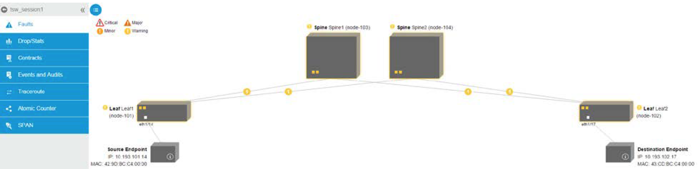
 
2. To see all the faults, click the List icon at the top left of the work pane.
  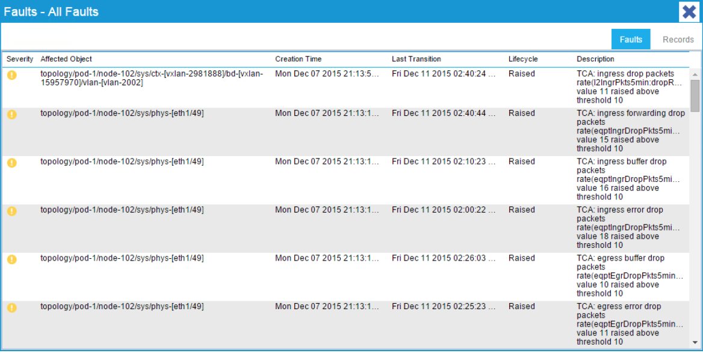
 
#### Drops/Stats ####

In this section you can see any packet drops on the logical topology.

1. Click **Drop/Stats** in the side menu.

2. Review the logical topology, which is similar to the earlier display in the Topology window.
  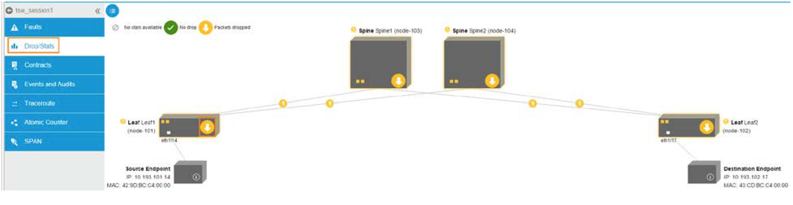

3. Click any yellow icons with the down arrow to see the statistics on that device / node.
  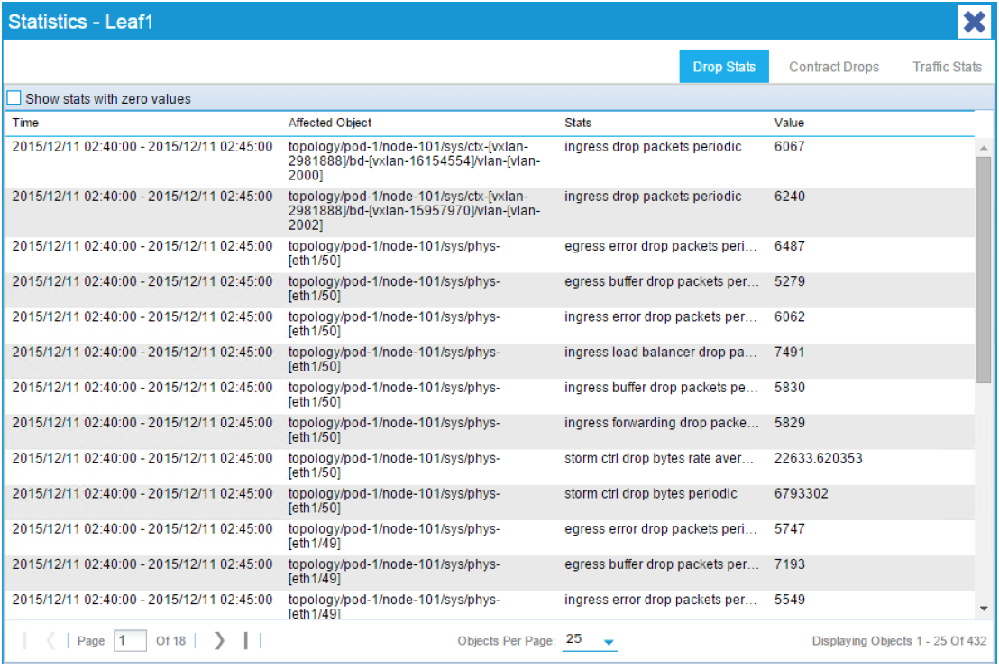
 
#### Contracts ####

Contracts are enforced between EPGs (End Point Groups). Bi-directional contracts are shown in the figure below.

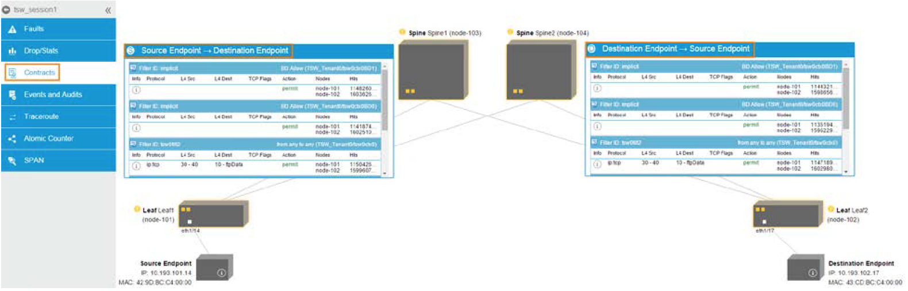

1. Click **Contracts** on the side menu.

2. The **Source Endpoint to Destination Endpoint** box shows the contracts, including filters with node IDs and hit counts.

3. The **Destination Endpoint to Source Endpoint** box shows the same information in the reverse direction.

#### Traceroute ####

The purpose of this section is to run fabric-aware traceroute on multipath based on the direction and protocols.

>**NOTE**: In a real Cisco ACI Fabric you should see traceroute **GREEN** from leaf1 all the way to destination host for Source to Destination and vice versa. The APIC Simulator only shows traceroute from the Spines.

1. Click **Traceroute** in the side menu.

2. Select ICMP from the Protocol drop-down and click the Play button to start the traceroute, then click **OK**.

3. A **GREEN** path from the source to the destination is displayed, because no issues are present.

  

#### Atomic Counter ####

The Atomic Counter counts packets and bytes between source and destination. Only packets that traverse the fabric are counted. Locally switched packets are not counted.

1. Click **Atomic Counter** in the side menu.

2. Click **Play** to start the below shows Ongoing Counters. Click **OK**.

3. Wait approximately two minutes for the counter table to generate.

  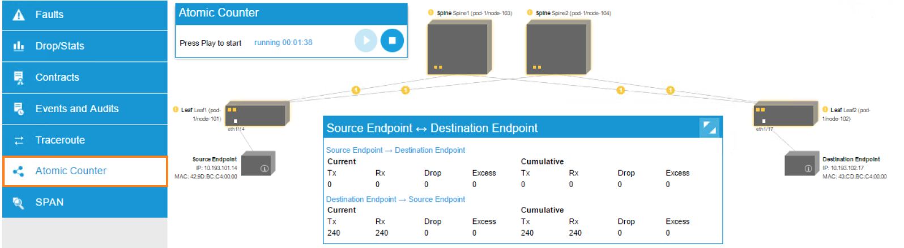
