## Scenario 2. Single-Tenant with a Single-Node Graph via the Northbound API
The purpose of this scenario is to use a preconfigured Python script to create one tenant with one single-node graph within the APIC.
> NOTE: If you have already created objects in the APIC, you must [remove those objects](../Scenario4) before running this scenario.

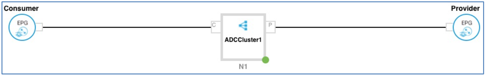

> NOTE: The Python script method calls individual XML scripts to create a series of objects. To pause the script and create an object using an APIC wizard, see the instructions inline. Objects that can be created via wizard using this script are indicated with (*) in the list below.


The Python script performs the following functions:

* Creates a Tenant
* Imports Citrix Device Package
* Creates L4-L7 Device Cluster*
* Create Concrete Device
* Create Logical Interfaces
* Connect Interfaces of Logical to Concrete Device
* Creates the Application Profile
* Creates the Security Contract
* Creates the Service Graph
* Attaches Service Graph to Contract*

Use the User Interfaces of Cisco APIC and NetScaler VPX to confirm deployed settings:

* View VLAN’s in APIC
* View Load Balancing Virtual Server and VLAN’s in NetScaler VPX
* View Port Group mappings for VPX
* Verify MAC addresses for VPX in VMware vCenter
* Verify deployed L4-L7 parameters in NetScaler VPX

Method  | Automation Level | Explanation   | Completion Time | Notes
------------- | ------------- | ------------- | -------------   |------------- 
Use Python Scripting to Build Objects Within the APIC  | High |  To configure the APIC objects with scripts, the user downloads a set of configuration scripts and employs them in a command window, monitoring the output via the APIC UI.| 20 minutes      | To maximize the effectiveness of this Scenario, view the relevant directories in APIC while the Python scripts are working, to show the discovery of the network objects in real-time.
Manual Configuration of Individual Objects  | Low  | Use an APIC wizard and the configuration parameters provided in this script to manually create each required object| 60 minutes      | See the links in each step to the procedure for manual object creation.

### Steps 

1. From the demonstration workstation, go to the open **Application Policy Infrastructure Controller** window.

2. If the application is not open, launch **Application Policy Infrastructure Controller** by clicking the **APIC Login** icon.

	 a. Log in with the following credentials: Username: admin, Password: **C1sco12345**.
3. Click **VM Networking** from the top menu.
4. Expand the **VMware** folder and show that there is no VMware present.
5. Click the PuTTY shortcut to open the application, then double-click Tools to load the stored session.
 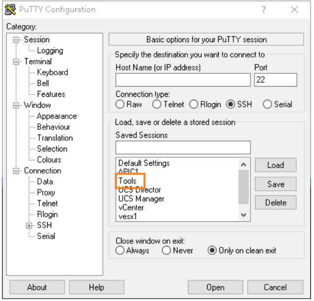
6. Login to PuTTy (**user01/user01**) and place it so that both the PuTTY window and the APIC directories are visible.
 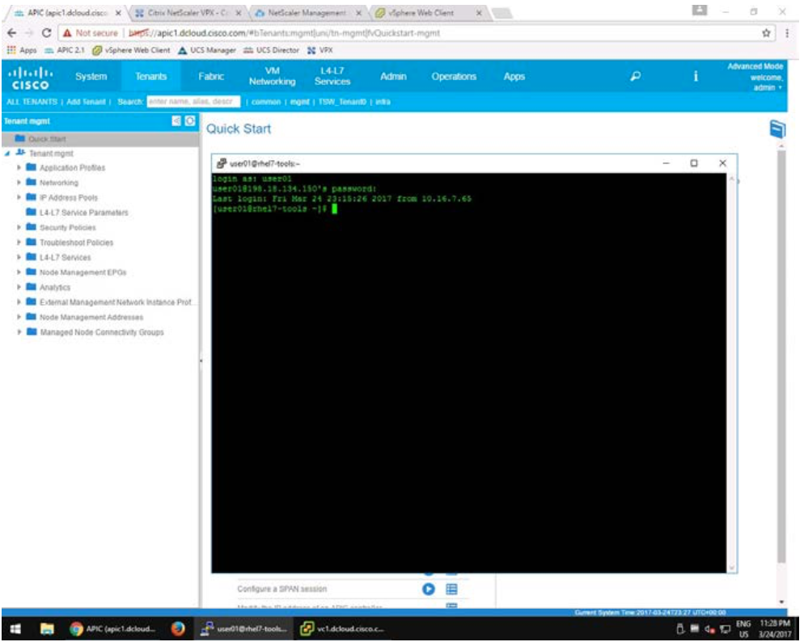
7. From the command line type **./request.py Citrix_Scripts/Build_Citrix_VPX.cfg** and hit **<Enter>**. 
> NOTE: To show the XML code as the Python script calls each XML script, substitute
**./xml_request.py Citrix_Scripts/Build_Citrix_VPX.cfg** for the above command.
 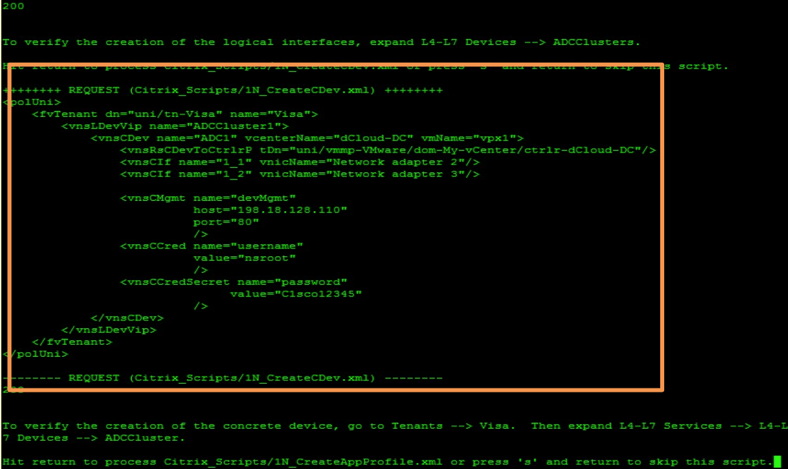
> This is an example of the partial XML output for the **Build_Citrix_VPX.xml** script. 

	The Build_Citrix_VPX.cfg script utilizes a series of XML scripts to perform the necessary configuration steps. It will pause between each of the XML scripts, and the user can either press <Enter> to run the script, or type s to skip the script
and configure the object via a wizard. While the script is running, a brief description will display what that script is doing, while the APIC window updates in real-time. When a script completes successfully, the success code 200 will appear onscreen.
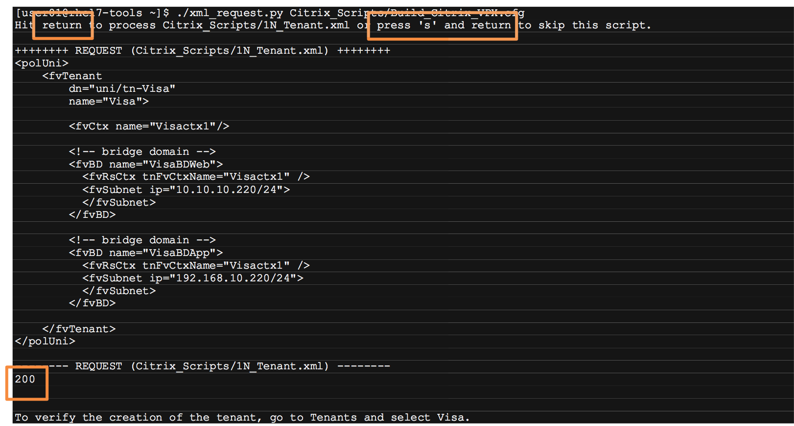
>The following step creates the tenant in APIC. To perform this procedure manually, type s and hit enter at the prompts for the 1N_Tenant.xml script.

8. Create the **Tenant**.

 	a. In the APIC top menu, select **Tenants**. Select **ALL TENANTS** from the top sub-menu.
 	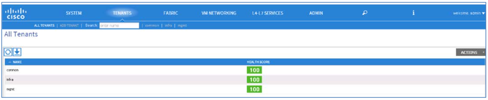
 	
 	b. Return to the PuTTY window and hit **Enter** at the Hit return to process **Citrix_Scripts/1N_Tenant.xml or press‘s’ and return to skip this script** prompt.
 	
	c. The **Visa** tenant is created and displayed in the top menu. If necessary, click **Refresh**   to display it in the tenant list. (If a **Server Side Error** message is generated, wait a few seconds before refreshing again.)
	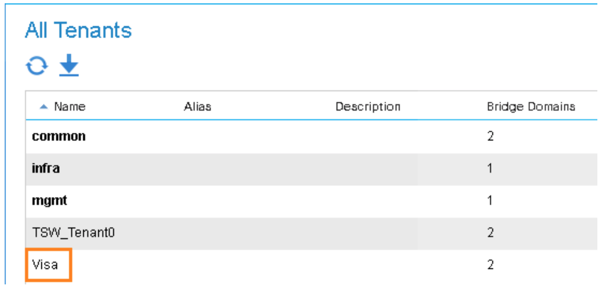

	d. Double-click the newly created **Visa** tenant.

	e. Expand the **Tenant Visa > Networking > Bridge Domains** directory to show that the **VisaBDApp** and **VisaBDWeb**
bridge domains have been created.

	f. Expand the **Tenant Visa > Networking > VRFs** folder to show that the **Visactx1** private network has been created.
	
9. Import the **Citrix Device Package** as follows:
	
	a. From the top menu, select **L4-L7 Services**.
	
	b. From the top sub-menu, select **Packages**.
	
	c. Expand the **L4-L7 Services Device Types** folder and show that no packages are present.
	
	d. Return to the PuTTY window and hit <**Enter**> at the **Hit return to process Citrix_Scripts/DevicePackage-11.0-65.36.zip or press‘s’ and return to skip this script** prompt.

	e. The **Citrix-NetScaler-1.0** device package appears in the **L4-L7 Services Device Types** directory as it is created.
	
	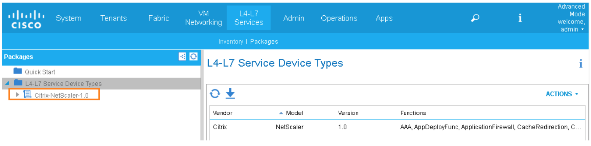
> NOTE: The next three steps create the device cluster, concrete devices and logical interfaces in the APIC. To create these devices manually, type s and hit enter at the prompts for the following scripts:
>
> * 1N_CreateLDevVip.xml
> * 1N_CreateCDev.xml
> * 1N_CreateLIf.xml

10. Create the Device Cluster:
	
	a. From the top menu of the APIC window, select TENANTS.
	
	b. From the top sub-menu, select **Visa**.

	c. Expand the **L4-L7 Services > L4-L7 Devices** folder and show there are no device clusters present.
	
	d. Return to the PuTTY window and hit <**Enter**> at the **Hit return to process Citrix_Scripts/1N_CreateLDevVip.xml or press‘s’ and return to skip this script** prompt.
	
	e.Verify the creation of the **ADCCluster1** device cluster.

11. Create the device cluster logical interfaces as follows:

	a. Still in **TENANTS > Visa**, expand **L4-L7 Services** > **L4-L7 Devices** > **ADCCluster1**, which is empty. 

	b. Return to the PuTTY window and hit <**Enter**> at the **Hit return to process
Citrix_Scripts/1N_CreateLIf.xml or press ‘s’ and return to skip this script** prompt.
	
	c. Expand **ADCCluster1**, which is now populated with the **inside**, **outside**, and **mgmt** Logical Interfaces.
	
12. Create the **Concrete Devices** for the **Visa** tenant as follows:

	a. Return to the PuTTY window and hit <**Enter**> at the Hit return to process **Citrix_Scripts/1N_CreateCDev.xml or press‘s’ and return to skip this script** prompt.

	b. The **ADC1** device is created in the **ADCCluster1** device cluster. Expand the **ADC1 device** to display the concrete interfaces.
	
	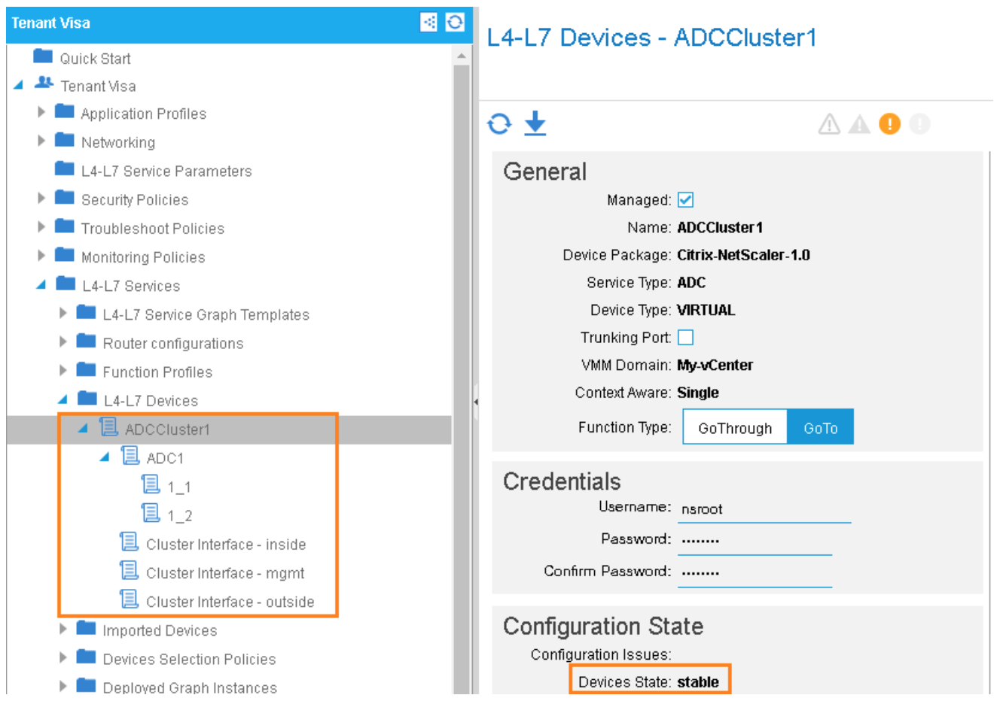
	
	>NOTE: Wait until the device cluster is in a stable state before proceeding. It may take up to 30 seconds and you may need to click the     icon.
	
13. Create
the Application Profile as follows:

	a. Still in the **Tenant Visa** directory, expand **Application Profiles**, which is empty.

	b. Return to the PuTTY window and hit <**Enter**> at the **Hit return to Process
Citrix_Scripts/1N_CreateAppProfile.xml or press‘s’ and return to skip this script**
prompt.

	c. The **sap** application profile drops into the directory as it is created. Expand **sap > Application EPGs to view the EPGs** - **EPG App** and **EPG Web**.

14. Create the **http** contract as follows:

	a. Expand **Security Policies > Contracts**.
	
	b. Return to the PuTTY window and hit <**Enter**> at the **Hit return to Process Citrix_Scripts/1N_CreateContract.xml or press‘s’ and return to skip this script** prompt.
	
	c. **webCtrct > http** is created in **Contracts**. 

15. Create the **Webgraph** Service Graph as follows:

	a. Still in the **Tenant Visa** directory, expand **L4-L7 Services > L4-L7 Service Graph Templates**, which is empty.
	
	b. Return to the PuTTY window and hit <**Enter**> at the **Hit return to process Citrix_Scripts/
1N_CreateWebGraph.xml or press ‘s’ and return to skip this script** prompt.

	c. **WebGraph** is created in the **Service Graphs** folder, with the **Function Node – N1** sub-directory. This script also
pushes the Port Profiles and Connections.

	d. Expand **Function Node – N1** to show the objects that have been created.
	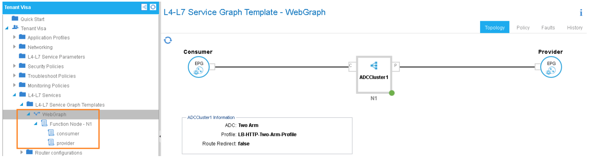

16. Optional – Click Function Node – N1 to show the items that have been configured.

17. Start vSphere from the Task Bar if it is not already started by clicking the icon,
Credentials checkbox is checked. Click Login.

18. Navigate to Home > Inventory > Networking to see the EPGs.
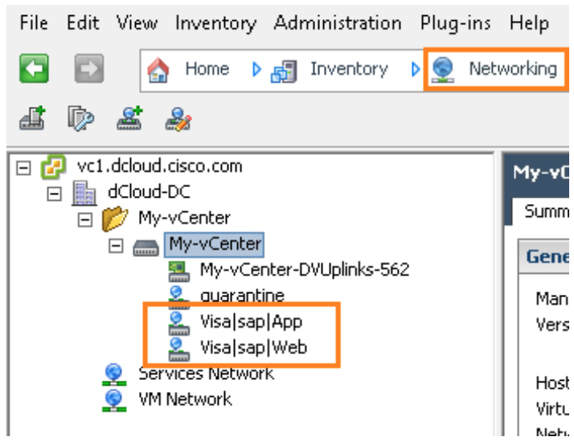
> Note: The next step runs the script that attaches the Service Graph to the Contract. To perform the procedure manually, type **s** at the prompts for the **Citrix_Scripts/1N_AttachWebGraph.xml** script:

19. Attach the **Service Graphs** to the **Visa** tenant, as follows:

	a. Still in **Tenants > Visa**, expand **L4-L7 Services > Deployed Service Graph Instances**, which is empty.

	b. Return to the PuTTY window and hit <**Enter**> at the **Hit return to process Citrix_Scripts/ 1N_AttachGraphToContract.xml or press ‘s’ and return to skip this script** prompt.

	c. Allow a few seconds for the script to finish. **webCtrct-WebGraph-Visactx1** drops into the **Deployed Service Graph** directory, showing the association.

20. Click the **Deployed Service Graph Instances** folder to show that the contract is listed in applied state.
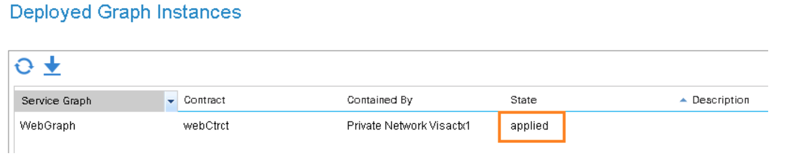

21. Return to the VMWare Client to see that the new port-profiles have been created.

22. Check the Recent Tasks bar to see the tasks to attach the new port-profiles to the Virtual machine – vpx1.
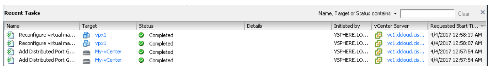

23. In the Location bar, click **Networking** and select **Hosts and Clusters** from the drop-down.
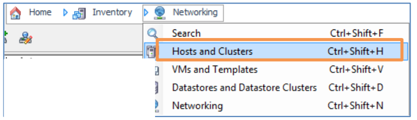

24. Click **vpx1** and click the **Summary** tab to display the parameters.
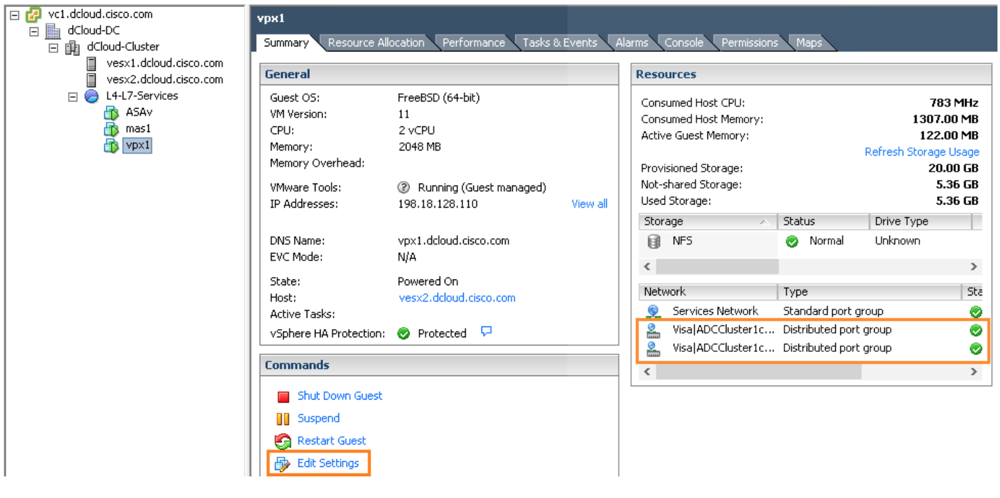

25. Click **Edit Settings** to bring up the **Parameters** configuration window, open to the **Hardware** tab. This shows the network adapters, relating the APIC EPGs to the Contract.
>NOTE: Check the Do Not Show This Message Again checkbox on the Restricted Virtual Machine Settings pop-up, and click OK. This warning can be ignored.
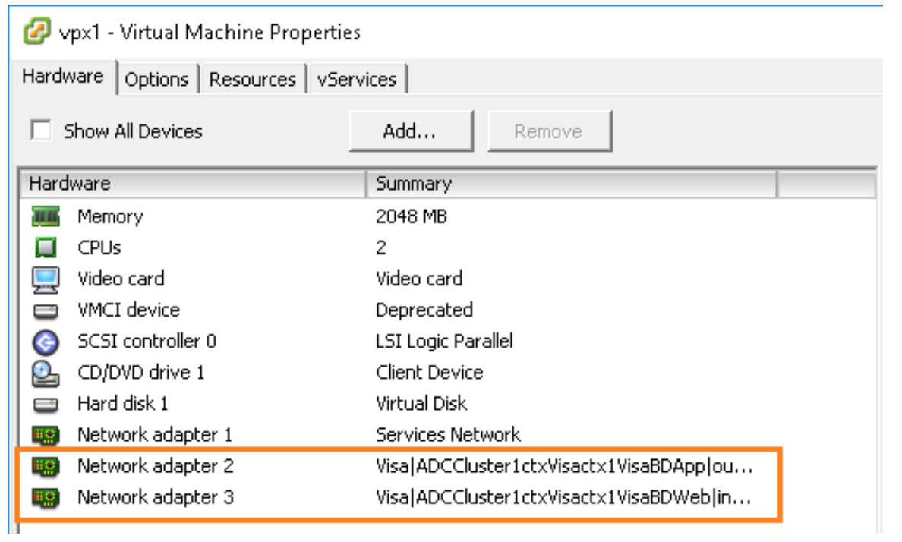

26. Return to the APIC and navigate to the **Tenant Visa > L4-L7 Services > Deployed Graph Instances** folder.
27. Click **webCtrct-WebGraph-Visactx1** to see the topology of the deployed Service Graph.
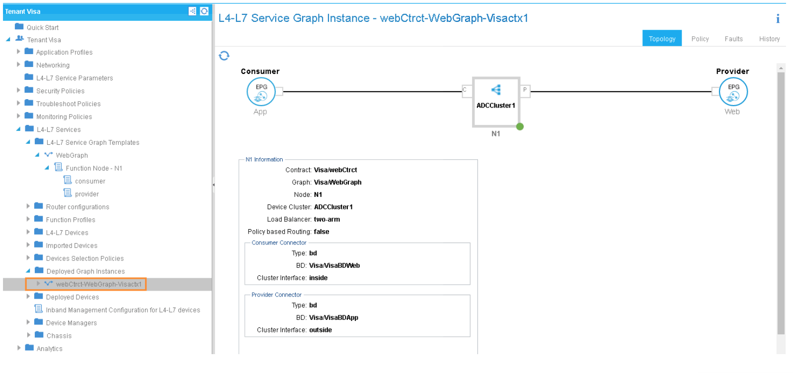

28. Expand Deployed Devices and click **ADCCluster1-Visactx1** to review VLANs.
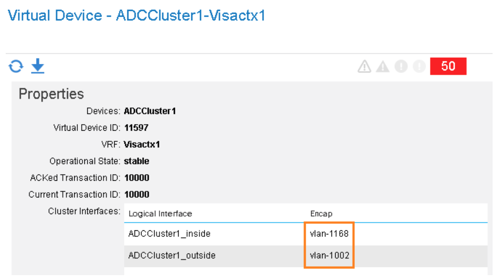

29. Verify that the MAC addresses and the correct Port-Profiles show:

	a. In the top menu of the APIC window, click **VM Networking > Inventory**.
	
	b. Expand **VMware > My-vCenter > Controllers > dCloudDC > Hypervisors > vesx1.dcloud.cisco.com > Virtual Machines and vesx2.dcloud.cisco.com > Virtual Machines**. (vpx1 may be on either host.)
	
	c. Click **vpx1** to display its parameters. See that the newly attached port-profiles show in the attached PORTGROUP field.
	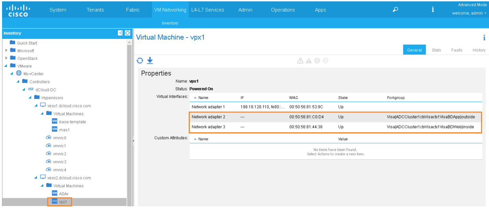

30. Open a new **Chrome** tab. In the Chrome Bookmarks Toolbar, click the **Netscaler VPX** bookmark and log in (**nsroot/C1sco12345**).
31. In the side menu, click **System > Network > VLANs** to display the VLANs. Verify that the VLANs match the ones showing in APIC.
  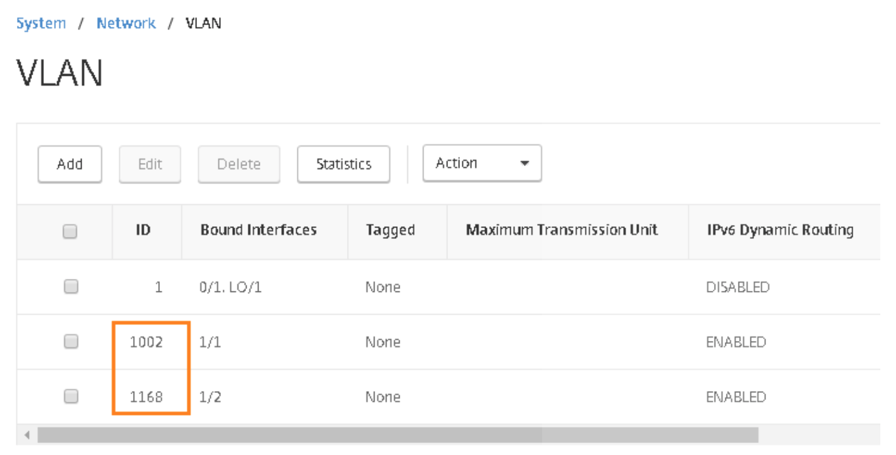

32. In the side menu, click **Traffic Management > Load Balancing > Virtual Servers** to display the Virtual Server created by the APIC.
  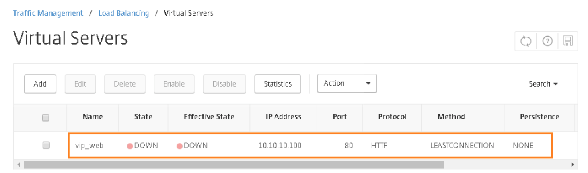

33. [Remove the configuration and reset the environment](../Scenario4) prior to starting another scenario.
