## Scenario 3. Single Tenant, Single Graph with Multi-Node via Northbound API
The purpose of this scenario is to use a preconfigured Python script to create one tenant with one graph, which is a multi-node graph within the APIC.

> NOTE: If you have already run a scenario that created objects in the APIC, you must [remove those objects](../Scenario4) before running this scenario. 
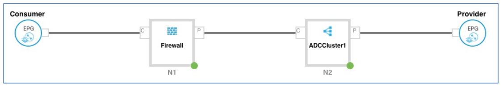
> NOTE: The Python script method calls individual XML scripts to create a series of objects. To pause the script and create an object using an APIC wizard, see the instructions inline. Objects that can be created via wizard using this script are indicated with * in the list below.

The Python script performs the following functions:

* Create a Tenant
* Create the Physical Domain
* Import Citrix Device Package and the Cisco ASAv Device Package
* Create L4-L7 Device Cluster
* Create Concrete Device
* Create Logical Interfaces
* Connect Interfaces of Logical to Concrete Device
* Create the Application Profile
* Create the Security Contract
* Create the Service Graph
* Attach Service Graph to Contract

Use the User Interfaces of Cisco APIC and NetScaler VPX to confirm deployed settings:

* View VLAN’s in APIC
* View Load Balancing Virtual Server and VLAN’s in NetScaler VPX
* View Port Group mappings for ASAv in VMware vCenter
* View Port Group mappings for VPX
* Verify MAC addresses for both VPX and ASAv in VMware vCenter
*  Verify deployed L4-L7 parameters in NetScaler VPX

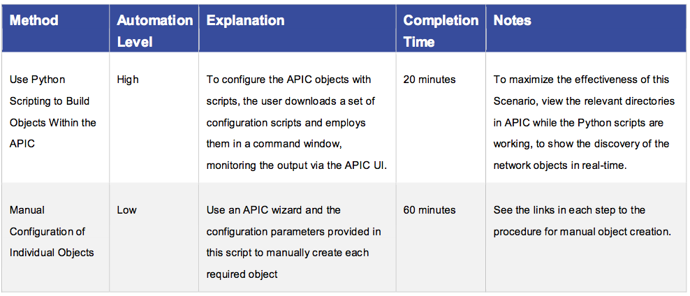

## Steps

1. From the demonstration workstation, click the **APIC Login** shortcut to open the Application Policy Infrastructure Controller window and log in (**admin/ C1sco12345**).

2. Double-click the **Cisco ASDM-IDM** icon to open the ASDM home page.

3. Click **Continue** at the Security Warning, and login (**admin/C1sco12345**).

	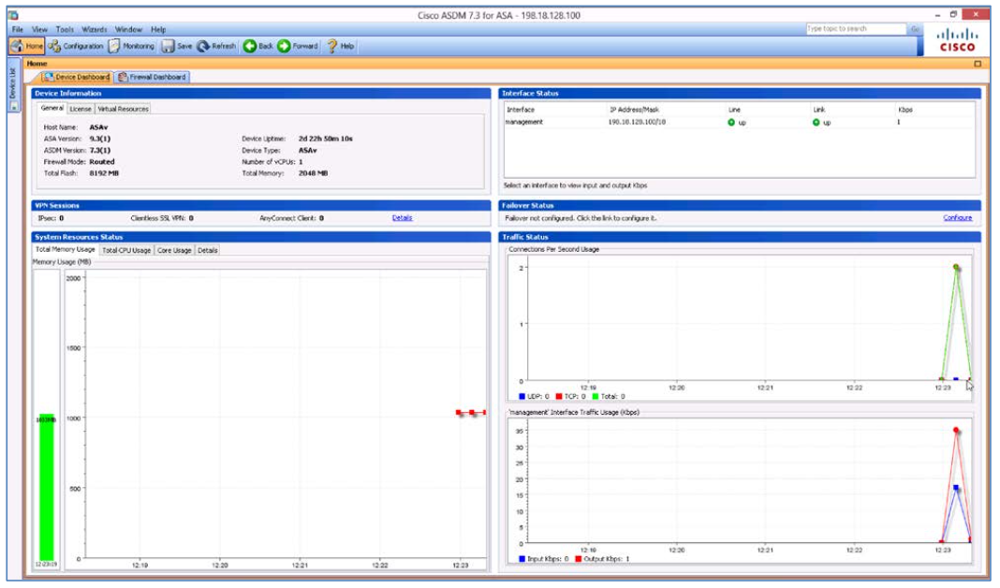

4. Minimize the ASDM window.

5. Click the **PuTTY** shortcut in the Task Bar to open the application.

6. Double-click **Tools** to load the stored session.

	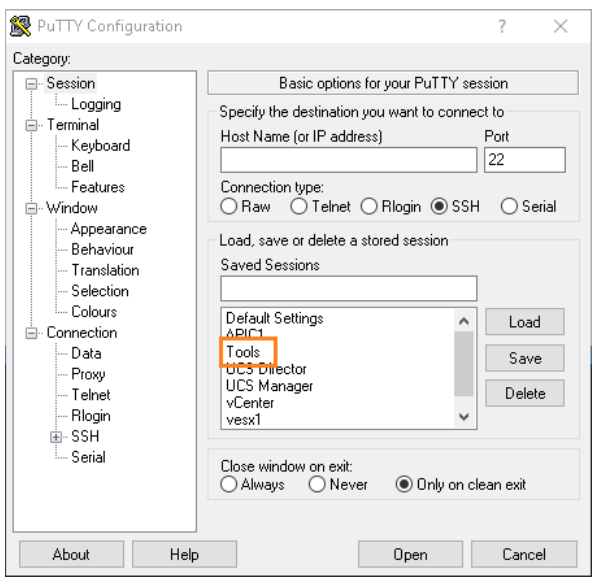

7. Login to PuTTy (**user01/user01**).

8. Place the window so that both the PuTTY window and the APIC directories are visible.

	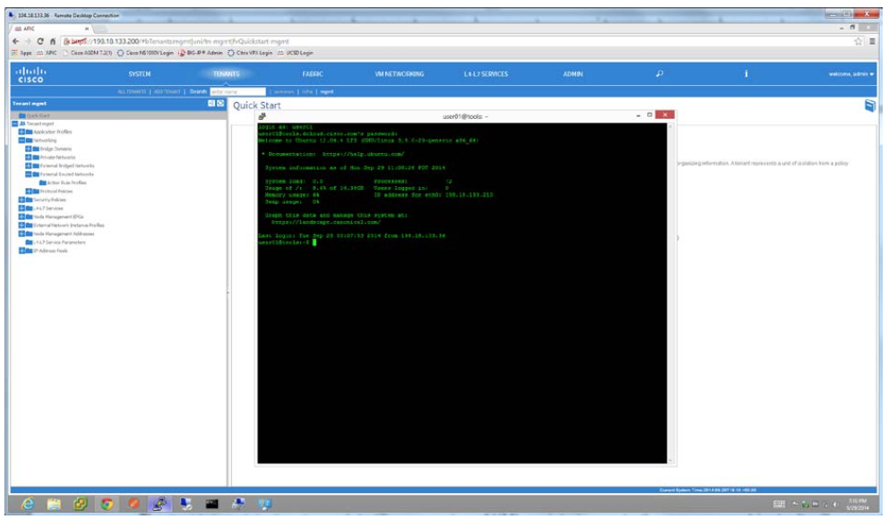

9. From the command line type **./request.py Citrix_Scripts/Build_ASA_Citrix.cfg** and hit **<Enter>**.

	> NOTE: To show the XML code as the Python script calls each XML script, substitute
**./xml_request.py Citrix_Scripts/Build_ASA_Citrix.cfg** for the above command.

	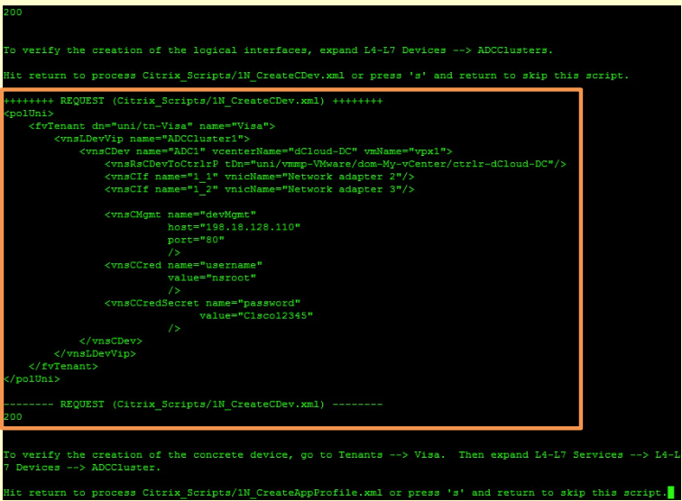

	> This is an example of the partial XML output for the Build_Citrix_VPX.xml script.

	The Build_ASA_Citrix.cfg script utilizes a series of XML scripts to perform the necessary configuration steps. It will pause between each of the XML scripts, and the user can either press <Enter> to run the script, or type s to skip the script and configure the object via a wizard. While the script is running, a brief description will display what that script is doing, while the APIC window updates in real-time. When a script completes successfully, the success code 200 will appear onscreen.

	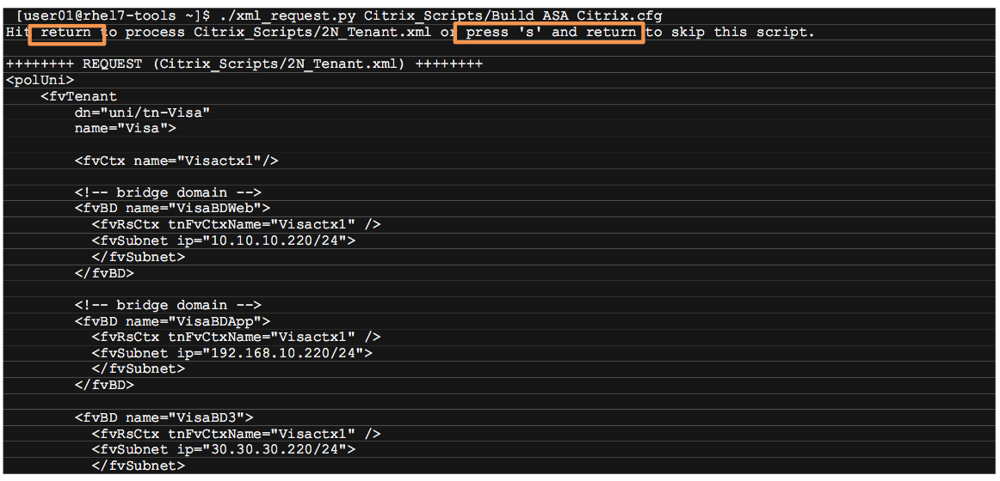

	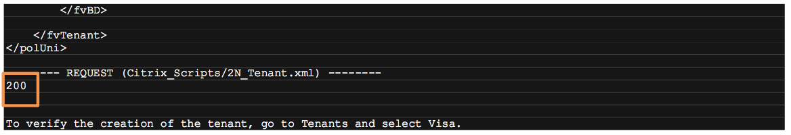

10. Create the **Tenants** 
	
	a. In the APIC top menu, click **Tenants**.
	
	b. Return to the PuTTY window and hit <**Enter**> at the **Hit return to process Citrix_Scripts/2N_Tenant.xmlor press ‘s’ and return to skip this script** prompt. The **Visa** tenant is created and displayed in the window.
	
	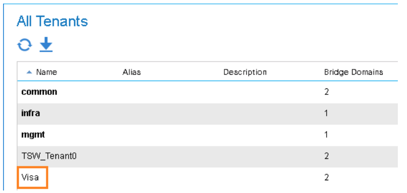

	c. Double-click **Visa** in the Tenants list.
	
	d. Expand the **Tenant Visa > Networking > Bridge Domains** directory to show that the **VisaBDApp, VisaBDWeb,
and VisaBD3** bridge domains have been created.
	
	e. Expand the **Tenant Visa > Networking > VRFs** folder to show that the **Visactx1** private network has been created. 

11. Import the **Citrix NetScaler Device Package** and the **Cisco ASAv Device Package** as follows:

	a. From the top menu, select **L4-L7 Services**.
	
	b. From the top sub-menu, select **Packages**.
	
	c. Expand the **L4-L7 Services Device Types** folder and show that no packages are present.

	d. Return to the PuTTY window.

	e. Hit <**Enter**> at the **Hit return to process Citrix_Scripts/DevicePackage-11.0-65.36.zip or press ‘s’ and return to skip this script** prompt.

	f. Hit <**Enter**> at the **Hit return to process Citrix_Scripts/asa-device-pkg-1.2.7.8.zip or press ‘s’ and return to skip this script** prompt.

	g. The **CISCO-ASA-1.2** and **Citrix-NetScaler-1.0** device packages appear in the **L4-L7 Services Device Types** directory as it is created.
	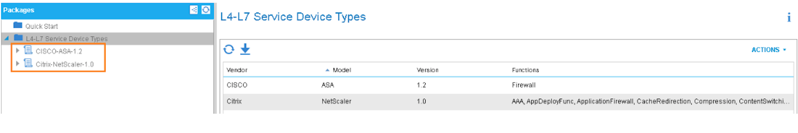
	
	> NOTE: The next three steps create the device cluster, concrete devices and logical interfaces in the APIC. To [create these devices manually](../Appendix/Appendix-D), type s and <Enter> at the prompts for the following scripts:
• 2N_CreateLDevVip.xml
• 2N_CreateCDev.xml
• 2N_CreateLIf.xml

12. Create the **Device Cluster**:

	a. From the top menu, select **Tenants**.

	b. Expand **L4-L7 Services > L4-L7 Devices** and show there are no device clusters present.
	
	c. Return to the PuTTY window and hit <**Enter**> at the **Hit return to process Citrix_Scripts/2N_CreateLDevVip.xml or press ‘s’ and return to skip this script** prompt.
	
	d. Verify the creation of the **ADCCluster1** and **Firewall** device clusters. 
	
13. Export the device cluster as follows:

	a. Expand **ADCCluster1** and **Firewall**.
	
	b. Return to the PuTTY window and hit <**Enter**> at the **Hit return to process
Citrix_Scripts/2N_CreateLIf.xml or press ‘s’ and return to skip this script** prompt.

	c. **ADCCluster1** and **Firewall** are populated with inside and outside Logical Interfaces. 
	
14. Create the **Concrete Devices** for the **Visa** tenant as follows:

	a. Return to the PuTTY window and hit <**Enter**> at the **Hit return to process Citrix_Scripts/2N_CreateCDev.xml or press ‘s’ and return to skip this script** prompt.

	b. The **ADC1** device is created in the **ADCCluster1** device cluster. Expand the **ADC1 device** to display the concrete interfaces.
	
	c. The **Firewall_Device_1** device is created in the **Firewall** device cluster. Expand **Firewall_Device_1** to display the concrete interfaces.
	
	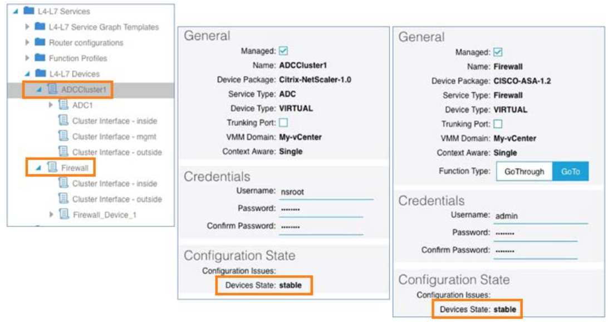

	> NOTE: W ait until both devices in the device cluster are in a stable state before proceeding. It may take up to 30 seconds and you may need to click the   icon.

15. Create the Application Profile as follows:

	a. Still in the **Tenant Visa** directory, expand **Application Profiles**, which is empty.

	b. Return to the PuTTY window and hit <**Enter**> at the **Hit return to Process Citrix_Scripts/2N_CreateAppProfile.xml or press ‘s’ and return to skip this script** prompt.
	
	c. The **sap** application profile drops into the directory as it is created. Expand the Application EPGs directory to view the EPGs – **EPG SAPApp** and **EPG SAPWeb**.
	
16. Verify the VM Domains are formed to the EPG as follows:

17. Expand each EPG **SAPApp** and **SAPWeb** in turn and click **Domains (VMs and Bare-Metals)** to see that the **State** of My- vCenter and Phys is **formed**.

	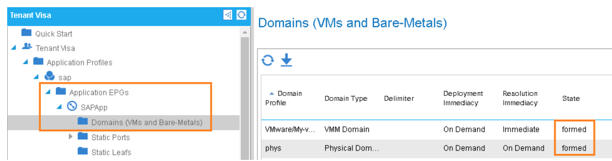

18. Create the contracts as follows:

	a. Still in the **Tenant Visa** directory, expand **Security Policies > Contracts**.

	b. Return to the PuTTY window and hit <**Enter**> at the **Hit return to Process Citrix_Scripts/2N_CreateContract.xml or press ‘s’ and return to skip this script** prompt.
	
	c. **webCtrct > http** is created in **Contracts**. 
	
19. Create the WebGraph **Service Graph** as follows:

	a. Still in **Tenants > Visa**, expand **L4-L7 Services > L4-L7 Service Graph Templates**, which is empty. 
	
	b. Return to the PuTTY window and hit <**Enter**> at the **Hit return to process
Citrix_Scripts/2N_CreateGraph.xml or press ‘s’ and return to skip this script** prompt. 

	c. **WebGraph** is created in the **L4-L7 Service Graph Templates** folder, with **Function Node – N1**, and **Function Node
– N2** sub-directories. This script also pushes the Port Profiles.

	d. Expand the two **Function Nodes** to show the objects that have been created.
	
	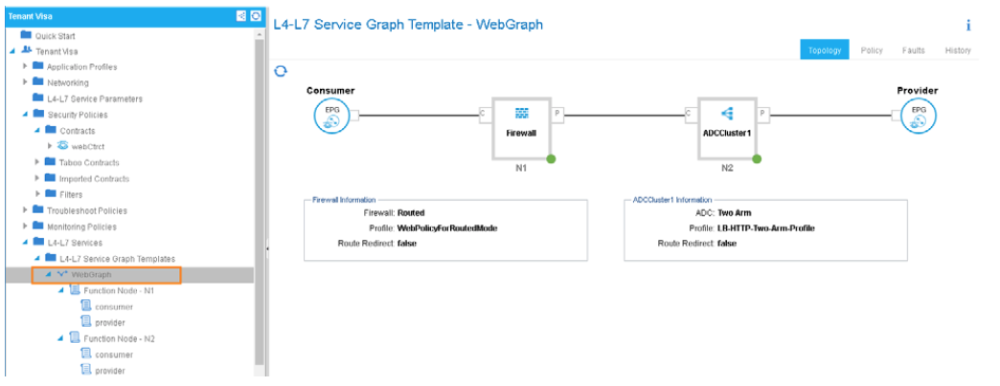

20. Optional – Click each **Function Node** to show all the parameters that have been configured.

	> NOTE: The next step runs the script that attaches the Service Graph to the Contract. To [perform the procedure manually](../Appendix/Appendix-E), type **s** at the prompts for the **Citrix_Scripts/2N_AttachGraphToContract.xml** script:

21. Attach the **Service Graphs** to the **Visa** tenant, as follows:

	a. Still in the **Tenants> Visa**, directory, expand **L4-L7 Services > Deployed Graph Instances**, which is empty.

	b. Return to the PuTTY window and hit <**Enter**> at the **Hit return to process Citrix_Scripts/2N_AttachGraphToContract.xml or press ‘s’ and return to skip this script** prompt.

	c. Allow a few seconds for the script to finish. **webCtrct-WebGraph-Visa** drops into the **Deployed Graph Instances** directory, showing the association.

22. Click the **L4-L7 Services > Deployed Graph Instances** folder – the contract is listed in applied state.

	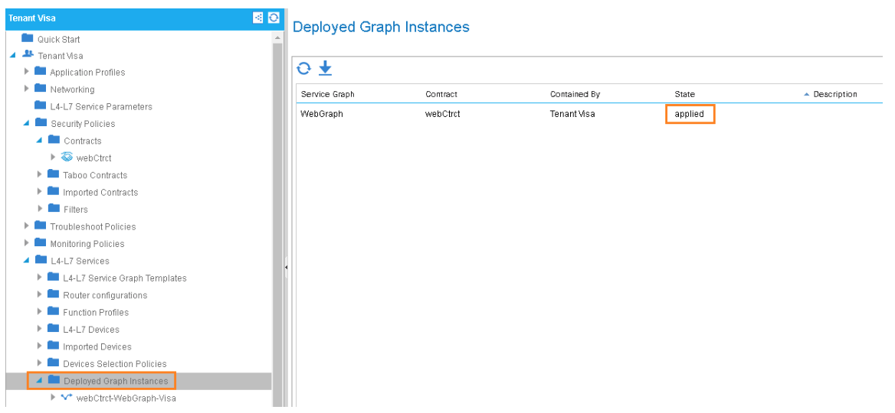

23. Click webCtrct-WebGraph-Visa to see the topology of the deployed Service Graph.

	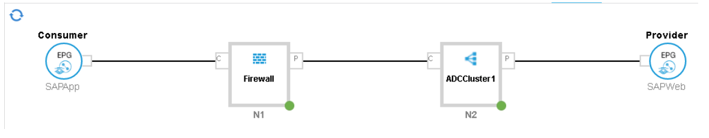

24. Expand Deployed Devices and click ADCCluster1-visactx1 and Firewall-visactx1 to review the VLANs allocated.

	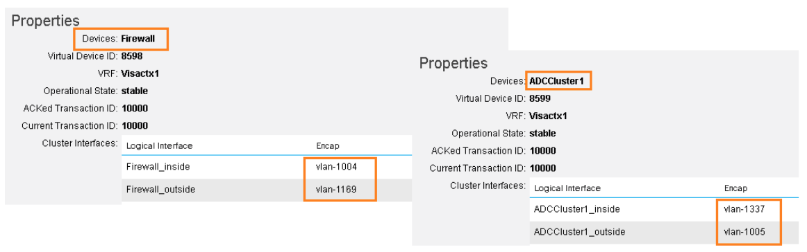

25. Open a new **Chrome** tab. In the Chrome Bookmarks Toolbar, click the **NetScaler VPX** shortcut and login with credentials **nsroot/C1sco12345**.

26. Expand **Traffic Management > Load Balancing** on the left menu and click **Virtual Server** to display the Virtual Server created by APIC.

	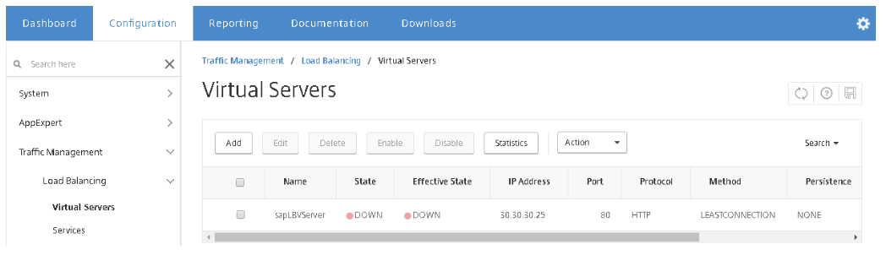

27. Expand **System > Network** on the left menu and click **VLANs** to display the VLANs. Verify that the VLANs match the ones from the ADCCluster1 device in APIC.

	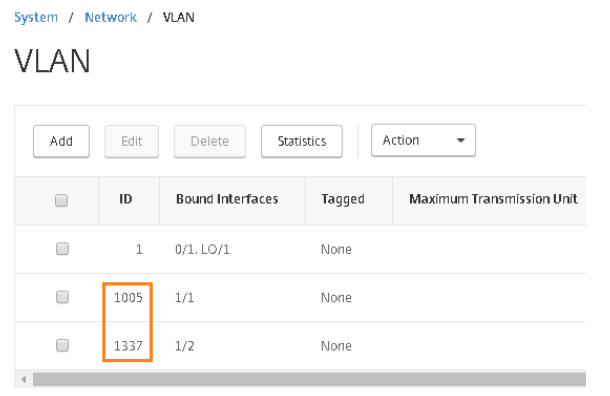

28. Return to vSphere, or login with **Windows login credentials**.
 
29. Navigate to the **Networking** screen to see the creation of the additional Port-Profiles.

	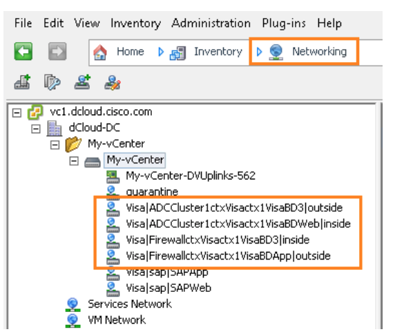

30. In the Location bar, click **Networking** and select **Hosts and Clusters** from the drop-down.

	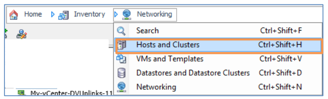

31. Click **vpx1** to display the parameters.

32. Click **Edit Settings** to bring up the **Parameters** configuration window, open to the **Hardware** tab.

	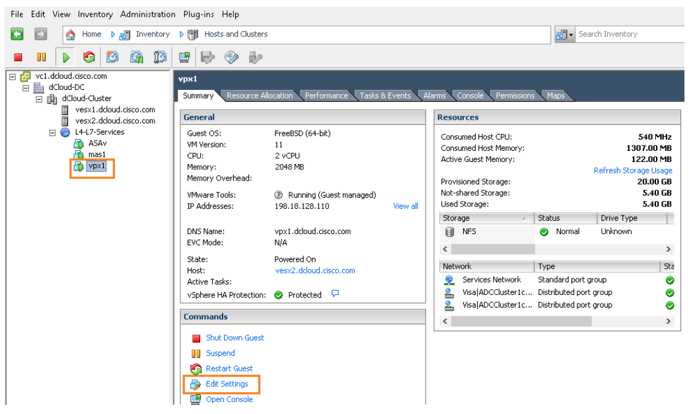

33. Click **network adapter 2** and **network adapter 3** to display the MAC addresses. Use the displayed MAC addresses to compare them to those in the APIC (see Step 33).

	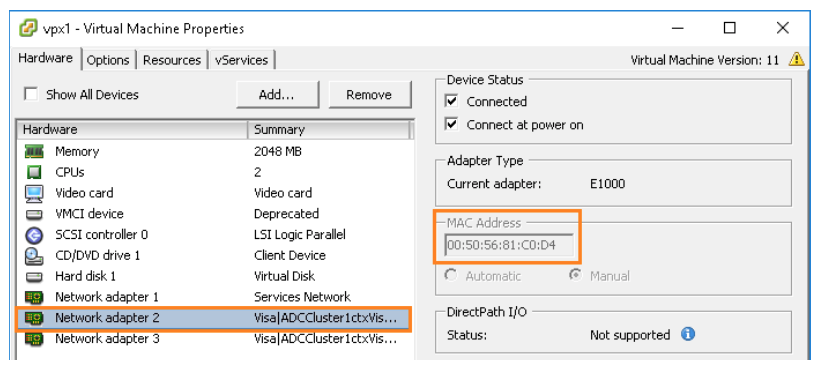

34. Verify that the MAC addresses and PORTGROUP show in the **APIC** window:

	a. Click **VM Networking** in the top menu.
		
	b. Expand **VMware > My-vCenter > Controllers > dCloudDC > Hypervisors > vesx1.dcloud.cisco.com > Virtual Machines and vesx2.dcloud.cisco.com > Virtual Machines**. (vpx1 may be running on either host.)

	c. Click **vpx1** to display its parameters. Check that the MAC addresses and PORTGROUPs are associated.
	
	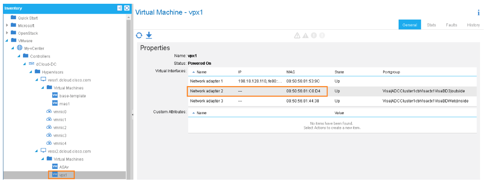

35. If desired, repeat Steps 31-34, this time clicking **ASAv** in vSphere and APIC to compare the MAC addresses.

36. If desired, repeat Steps 31-34, this time clicking **mas1** in vSphere and APIC to compare the MAC addresses.

37. Return to the ASA ADSM console and you will see the additional interface created. If it does not appear within a few seconds, click Refresh.

	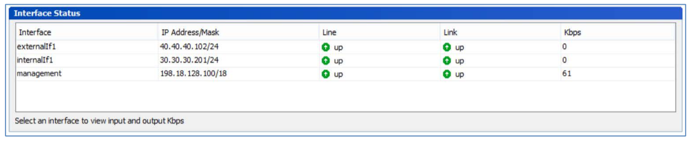

38. [Remove the configuration and reset the environment](../Scenario4) prior to starting another scenario.
