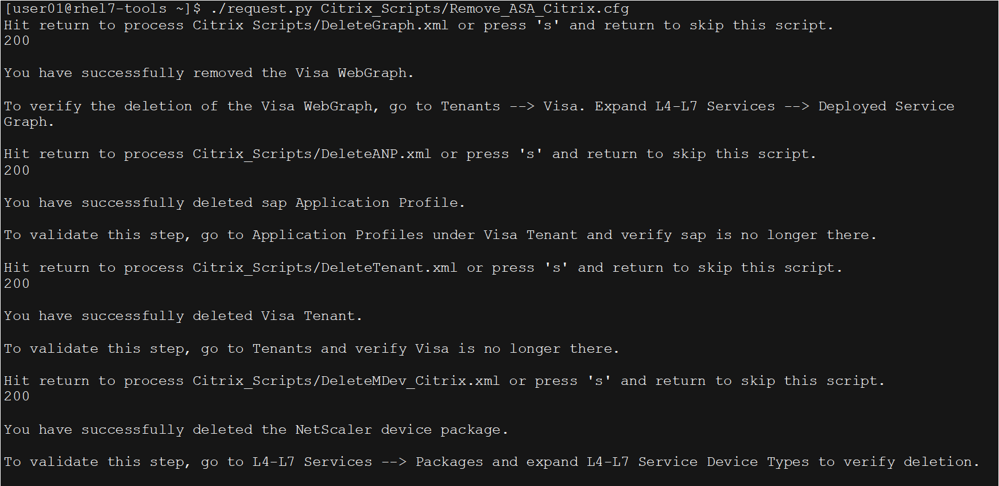
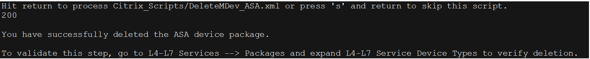

## Scenario 4. Removing APIC Objects

This scenario can only be performed after the APIC objects are created, whether the creation method was via Python script, APIC wizard, or manual.

>**NOTE**: If performing this Scenario immediately after Scenario 2, leave the APIC window open with all the directories expanded, to demonstrate the objects being removed in real-time.

1. If the PuTTY application is closed and you have to reopen it, it will be necessary to reload the Python script package, as follows:
 
	1. From the demonstration workstation, launch **PuTTY**.
	2. In the **PuTTY** **Configuration** window:

		1. In the **Saved Sessions** area, double-click **TOOLS**.
		2. Log in with the following credentials: Username: **user01**, Password: **user01**.

2. In the PuTTY command window, type the removal script:

	1. To remove objects created in [Scenarios 2](../Scenario2) and [5](../Scenario5), type `./request.py Citrix_Scripts/Remove_Citrix_VPX.cfg` at the command prompt and press **ENTER**.
	2. To remove objects created by Scenario 3 and 6, type `./request.py Citrix_Scripts/Remove_ASA_Citrix.cfg` at the command prompt and press **ENTER**.

 > The python script will step through multiple XML scripts to remove the objects. Display the APIC window, open to **Tenants > Visa**, expanding each folder to see the objects being removed.

3. Press **ENTER** at each prompt to walk through the script. An output description provides basic information on what the script is doing (see next page.) After each completed item, the script will return the code 200, indicating success.

 

 

4. Close all open application windows, returning to the wkst1 desktop. Optional – begin a new scenario:

	* [Scenario 2](../Scenario2): Building a Single-Tenant with a Single-Note Graph within the APIC via the Northbound API
	* [Scenario 3](../Scenario3): Building a Single-Tenant with a Multi-Node Graph within the APIC via the Northbound API
	* [Scenario 5](../Scenario5): Building a Single Tenant with a Single-Node Graph within the APIC using Service Manager mode via the Northbound API
	* [Scenario 6](../Scenario6): Building a Single Tenant with a Multi-Node Graph within the APIC using Service Manager mode via the Northbound API

