## Scenario 5. Building a Single Tenant with a Single-Node Graph within the APIC using Service Manager mode via the Northbound API

The purpose of this scenario is to separate the L2-L3 and L4-L7 policy configuration by using a preconfigured Python script to create **one tenant** with **one single-node graph** within the APIC, and then use Citrix NetScaler MAS to configure the application policy.

 > **NOTE**: If you have already run a scenario that created objects in the APIC, you must [remove those objects](../Scenario4) before running this scenario.

 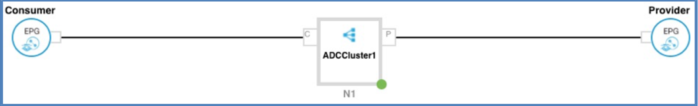

 > **NOTE**: The Python script method calls individual XML scripts to create a series of objects. To pause the script and create an object using an APIC wizard, see the instructions inline. Objects that can be created via wizard using this script are indicated with (*) in the list below.

The Python script performs the following functions:

* Create a Tenant
* Import Citrix Device Package
* Create L4-L7 Device Manager
* Create L4-L7 Device Cluster
	* Create Concrete Device
	* Create Logical Interfaces
	* Connect Interfaces of Logical to Concrete Device
* Create the Application Profile
* Create the Security Contract
* Create the Service Graph
* Attach Service Graph to Contract

Use the User Interfaces of Cisco APIC, NetScaler VPX, and NetScaler MAS to confirm deployed settings:

* View VLAN’s in APIC
* View Load Balancing Virtual Server and VLAN’s in NetScaler VPX
* View Port Group mappings for VPX
* Verify MAC addresses for VPX in VMware vCenter
* Deploy L4-L7 WebGraph parameters in NetScaler MAS
* Verify deployed L4-L7 parameters in NetScaler MAS and in NetScaler VPX

 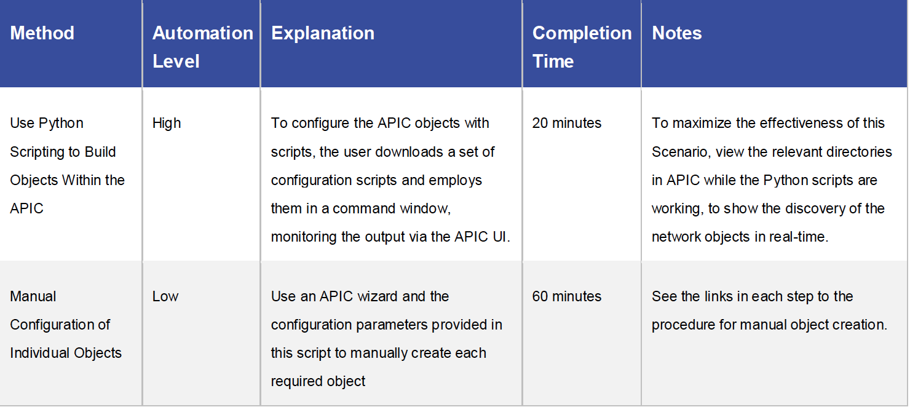

### Steps
1. From the demonstration workstation, go to the open **Application Policy Infrastructure Controller** window.

2. If the application is not open, launch **Application Policy Infrastructure Controller** by clicking the **APIC Login** icon.

	a. Log in with the following credentials: Username: **admin**, Password: **C1sco12345**.

3. Click **Tenants** in the top menu to show that there are no user-created tenants present.

4. Click the PuTTY shortcut to open the application, then double-click Tools to load the stored session.

 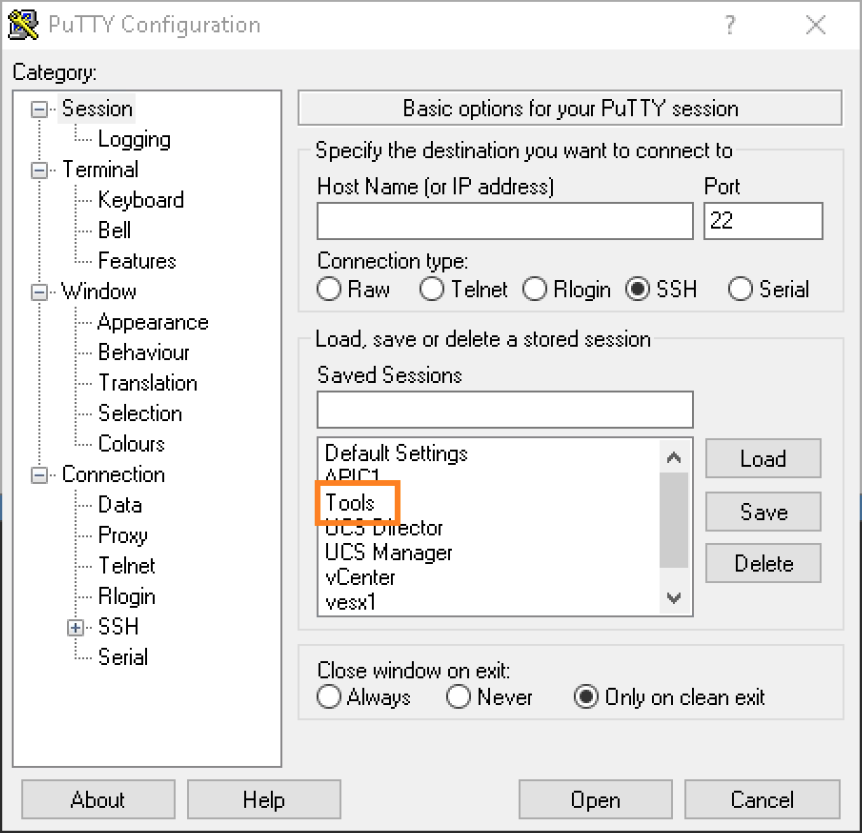

5. Login to PuTTy (**user01**/**user01**) and place it so that both the PuTTY window and the APIC directories are visible.

  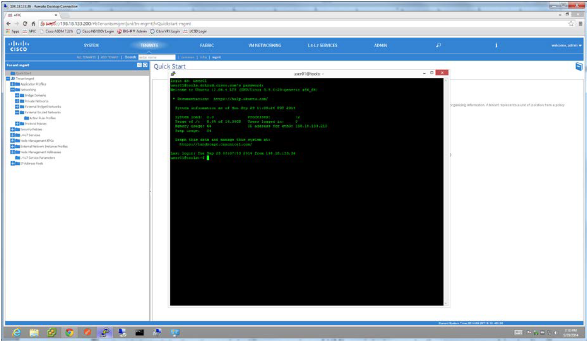
  
6. From the command line type .**/request.py Citrix_Scripts/Build_Citrix_VPX_MAS.cfg** and hit <**Enter**>.

 >**NOTE**: To show the XML code as the Python script calls each XML script, substitute ./xml_request.py Citrix_Scripts/Build_Citrix_VPX_MAS.cfg for the above command.
 >   
 >This is an example of the partial XML output for the Build_Citrix_VPX_MAS.xml script.

 The Build_Citrix_VPX_MAS.cfg script utilizes a series of XML scripts to perform the necessary configuration steps. It will pause between each of the XML scripts, and the user can either press <Enter> to run the script, or type s to skip the script and configure the object via a wizard. While the script is running, a brief description will display what that script is doing, while the APIC window updates in real-time. When a script completes successfully, the success code 200 will appear onscreen.

  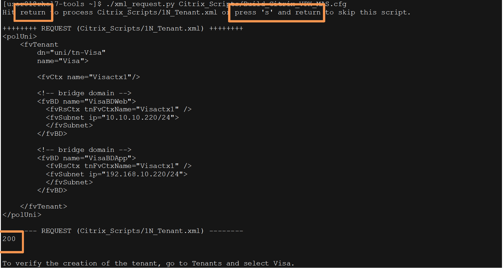
  
 > **NOTE**: The following step creates the tenant in APIC. To perform this procedure manually, type **s** and hit <**Enter**> at the prompts for the **1N_Tenant.xml** script.

7. Create the **Tenant**.

  * In the APIC top menu, select **TENANTS**.

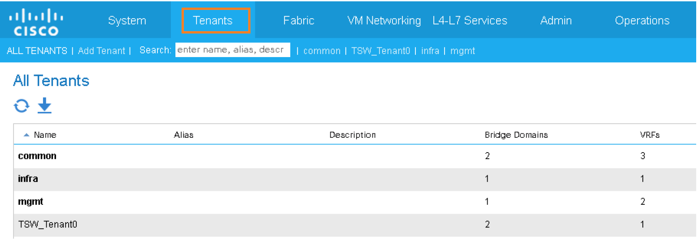

  * Return to the PuTTY window and hit <**Enter**> at the Hit return to process **Citrix_Scripts/1N_Tenant.xml** or **press‘s**’ and return to **skip this script prompt**.

  * The **Visa** tenant is created and displayed in the top menu. Click Refresh to display it in the tenant list. (If a **Server Side Error** message is generated, wait a few seconds before refreshing again.)

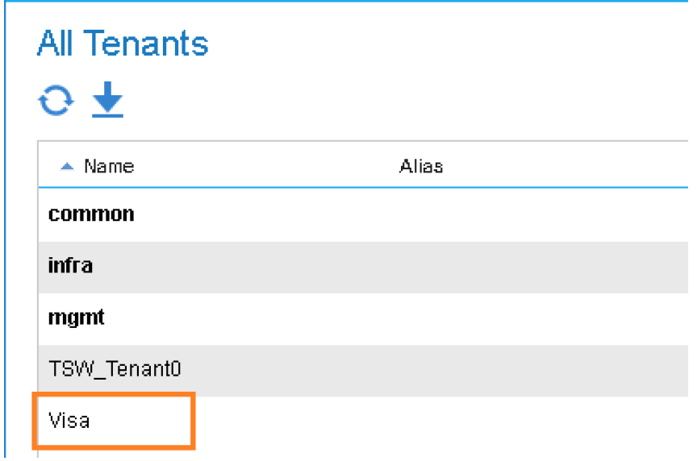

  * Double-click the newly created Visa tenant.

  * Expand the **Tenant Visa > Networking > Bridge Domains** directory to show that the **VisaBDApp and VisaBDWeb** bridge domains have been created.

  * Expand the **Tenant Visa > Networking > VRFs** folder to show that the **Visactx1** private network has been created.

8. Import the Citrix Device Package as follows:

  * From the top menu, select **L4-L7 Services**.
  
  * From the top sub-menu, select **Packages**.
  
  * Expand the **L4-L7 Services Device Types** folder and show that no packages are present.
  
  * `Return to the PuTTY window and hit <Enter> at the Hit return to process Citrix_Scripts/hybridModeDevicePackage-11.1-49.16.zip` or press ‘**s**’ and return to skip this script prompt.
  
  * The Citrix-NetScalerMAS-1.0 device package appears in the L4-L7 Services Device Types directory as it is created.
  
   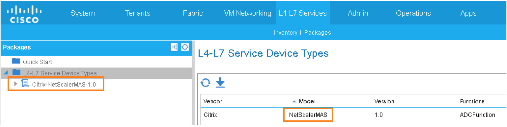

 > **NOTE**: The next four steps create the device cluster, concrete devices and logical interfaces in the APIC. To [create these devices manually](../Appendix/Appendix-D), type s and hit enter at the prompts for the following scripts:
 >
 > * CreatedevMgr.xml
 > * 1N_CreateLDevVip_MAS.xml
 > * 1N_CreateCDev.xml
 > * 1N_CreateLIf_MAS.xml

9. Create the **Device Manager**:

  * In the top menu of the APIC window, select Tenants. Depending on the last operation you performed, you will be directed to the Tenants List or the Tenant Visa page. If directed to the Tenants List, double-click **Visa**. (If the Visa tenant does not show in the list, click away from the TENANT menu item and then click **TENANT** again to refresh.)
 
  * Expand **L4-L7 Services > Device Managers** and show there are no device clusters present.
 
  * Return to the PuTTY window and hit <**Enter**> at the Hit return to process Citrix_Scripts/CreatedevMgr.xml.xml or press ‘**s**’ and return to skip this script prompt.
 
  * Verify the creation of the **NetScaler-MAS** Device Manager.
 
10. Create the **Device Cluster**:
 
  * Expand the **L4-L7 Services > L4-L7 Devices** folder and show there are no device clusters present.
 
  * Return to the PuTTY window and hit <**Enter**> at the Hit return to process Citrix_Scripts/1N_CreateLDevVip_MAS.xml or press‘**s**’ and return to skip this script prompt.
 
  * Verify the creation of the **ADCCluster1** device cluster.

11. Create the device cluster logical interfaces as follows:
 
  * Expand **L4-L7 Services > L4-L7 Devices > ADCCluster1**.

  * Return to the PuTTY window and hit <**Enter**> at the Hit return to process Citrix_Scripts/1N_CreateLIf_MAS.xml or press ‘**s**’ and return to skip this script prompt.
 
  * **ADCCluster1** is now populated with the inside, outside, and mgmt Logical Interfaces.

12. Connect logical interfaces to a Concrete Device for the Visa tenant as follows:
 
  * Return to the PuTTY window and hit <**Enter**> at the Hit return to process Citrix_Scripts/1N_CreateCDev.xml or press‘**s**’ and return to skip this script prompt.
 
  * The **ADC1** device is created in the **ADCCluster1** device cluster. Expand the **ADC1** device to display the concrete interfaces.
 
   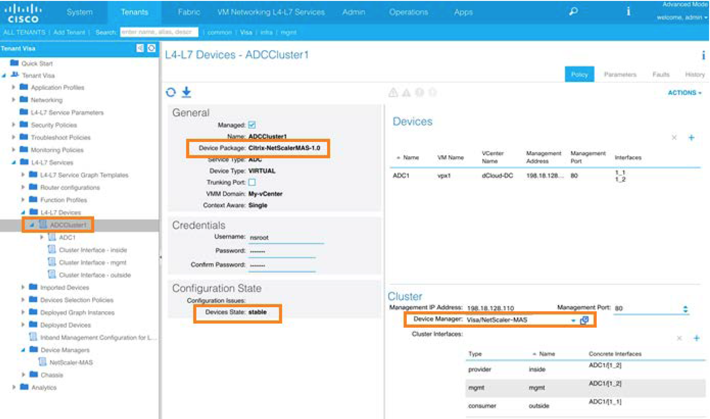

 > **NOTE**:Wait until the device cluster is in a **stable** state before proceeding. It may take up to 30 seconds and you may need to click the icon.
 
13. Create the **Application Profile** as follows:

  * Still in the **Tenant Visa** directory, expand **Application Profiles**, which is empty.

  * Return to the PuTTY window and hit <**Enter**> at the Hit return to Process Citrix_Scripts/1N_CreateAppProfile_MAS.xml or press‘**s**’ and return to skip this script prompt.

  * The **sap** application profile drops into the directory as it is created. Expand **sap > Application EPGs** to view the EPGs – **App** and **Web**.

14. Create the **http** contract as follows:
 
  * Expand **Security Policies > Contracts**.
 
  * Return to the PuTTY window and hit <**Enter**> at the Hit return to Process Citrix_Scripts/1N_CreateContract.xml or press ‘**s**’ and return to skip this script prompt.
 
  * **webCtrct > http** is created in **Contracts**.

15. Create the **Webgraph** Service Graph as follows:
 
  * Still in the **Tenant Visa** directory, expand **L4-L7 Services > L4-L7 Service Graph Templates**, which is empty.
 
  * Return to the PuTTY window and hit <**Enter**> at the Hit return to process Citrix_Scripts/1N_CreateWebGraph_MAS.xml or press ‘s’ and return to skip this script prompt.

  * **WebGraph** is created in the **L4-L7 Service Graph Templates** folder, with **Function Node – N1** sub-directories. This script also pushes the Port Profiles and Connections.

  * Click **WebGraph** to review the topology of the service graph template.

   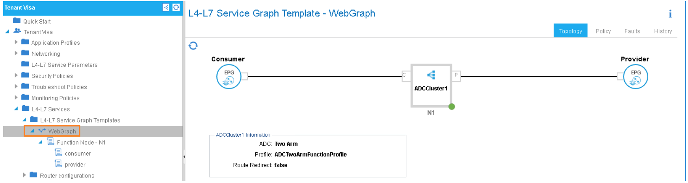
   
16. Optional – Click **Function Node – N1** to show the items that have been configured.

17. Start vSphere from the Task Bar by clicking the icon, and make sure the **Use Windows Credentials** checkbox is checked. Click **Login**.

18. Navigate to **Networking** to see how the EPGs are represented in vSphere.

   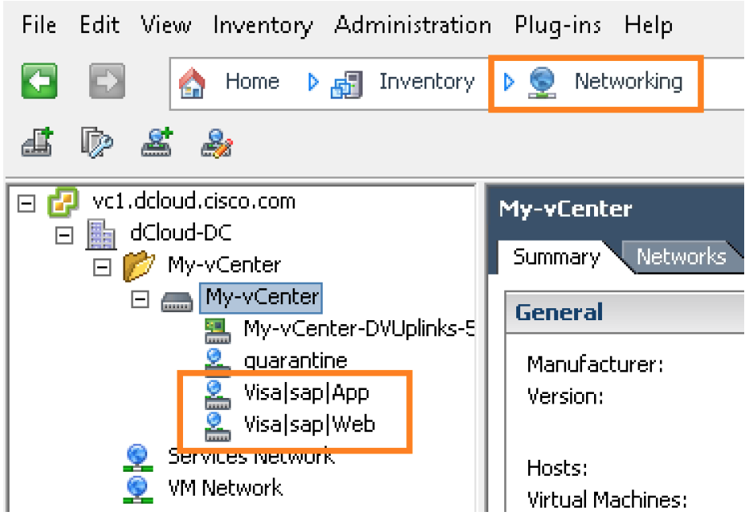

 > **NOTE**: The next step runs the script that attaches the Service Graph to the Contract. To [perform the procedure manually](../Appendix/Appendix-E), type '**s**' at the prompts for the Citrix_Scripts/1N_AttachGraphToContract.xml script:

19. Attach the **Service Graphs** to the **Visa** tenant, as follows:

  * Still in **Tenants > Visa**, expand** L4-L7 Services > Deployed Graph Instances**, which is empty.
 
  * Return to the PuTTY window and hit <**Enter**> at the Hit return to process Citrix_Scripts/1N_AttachGraphToContract.xml or press ‘**s**’ and return to skip this script prompt.
 
  * Allow a few seconds for the script to finish. **webCtrct-WebGraph-Visactx1** drops into the **Deployed Graph Instances** directory, showing the association.

20. Click the **L4-L7 Services > Deployed Graph Instances** folder – the contract is listed in applied state.

   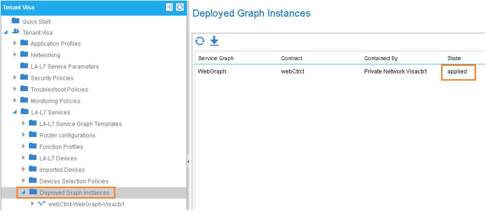

21. Return to the VMWare Client to see that the new port-profiles have been created.

   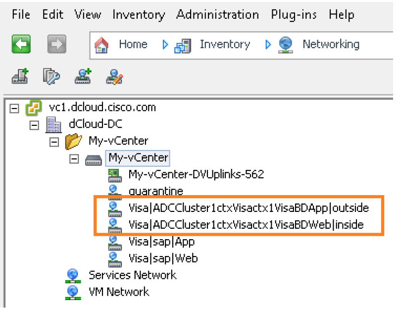

22. Refer to the **Recent Tasks** window to see the tasks that attach the new port-profiles to the Virtual machine – vpx1.

   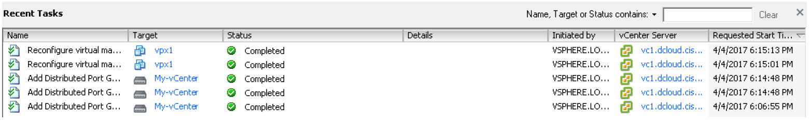

23. Return to the APIC and expand **Tenant Visa > L4-L7 Services > Deployed Graph Instances**. Click **webCtrct-WebGraph-Visactx1** to see the topology of the deployed Service Graph.

   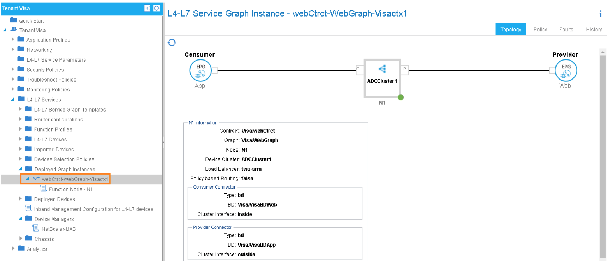

24. Expand **Deployed Devices** and click **ADCCluster1-Visactx1** to review VLANs.

   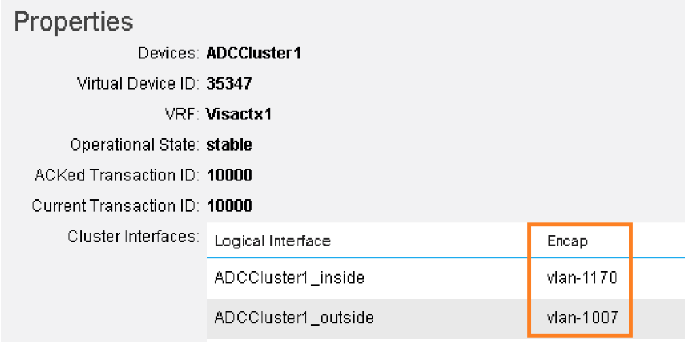
   
25. Open a new **Chrome** tab. Click the NetScaler VPX shortcut and login with credentials: **nsroot/C1sco12345**.

26. Expand **System > Network > VLANs** to display the VLANs. Verify that the VLANs match the ones showing in APIC.

   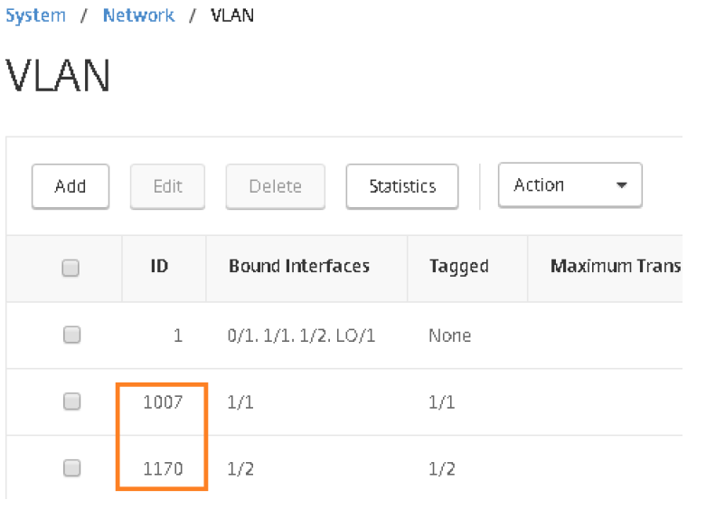

27. Obtain the MAC addresses for the network adapters in vSphere:

  * In the Location bar, click **Networking** and select **Hosts and Clusters** from the drop-down.

   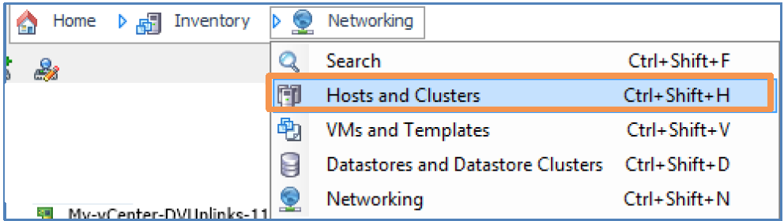

  * Click **vpx1** to display the parameters.

  * Click **Edit Settings** to bring up the Parameters configuration window, open to the Hardware tab.
 
   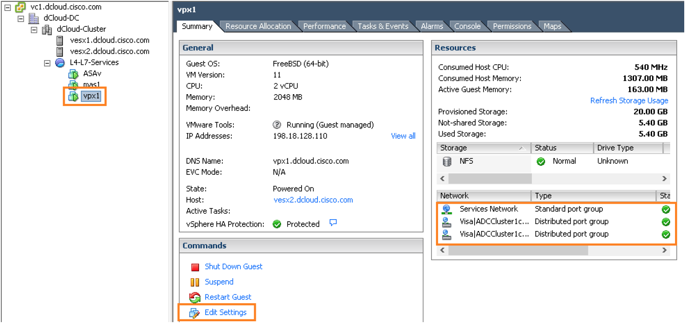

  * Click Network adapter 2 and Network adapter 3 to show the MAC Addresses.

   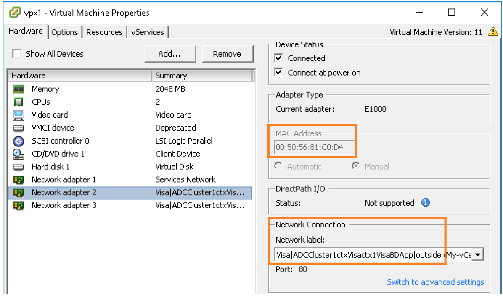

28. Return to APIC, and verify that the MAC addresses and the Port-Profiles match those in vSphere:
 
  * From the **VM Networking > Inventory** menu, expand **VMware > My-vCenter > Controllers > dCloudDC > Hypervisors > vesx1.dcloud.cisco.com > Virtual Machines** and **vesx2.dcloud.cisco.com > Virtual Machines**. (vpx1 may be on either host.)
 
  * Click **vpx1** to display its parameters. See that the newly attached port-profiles show in the **Portgroup** field.

   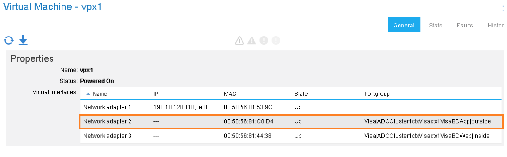

29. Use Netscaler MAS to configure the Application Policy:
 
  * Open a new **Chrome** tab. In the Chrome Bookmarks Toolbar, click the **NetScaler MAS** shortcut and log in (**nsroot/C1sco12345**).
 
  * Navigate to **Orchestration**, on the left menu click **SDN Orchestration**, and then click **Cisco ACI**.
 
  * In the work pane, click **APIC-HTTP-LB**.

   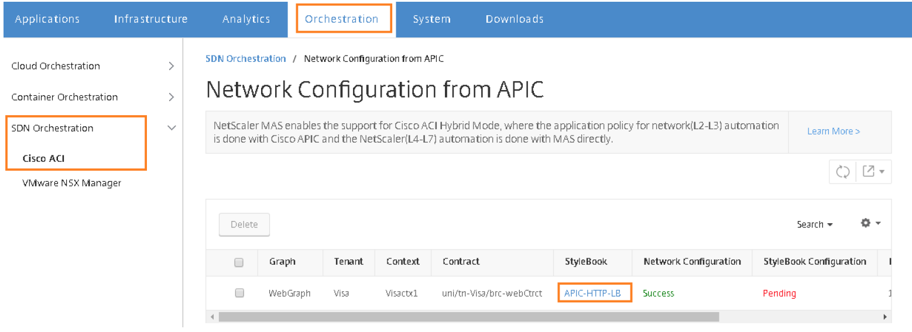
   
  * On the **Deploy Configuration** page, click **Sample Stylebook for APIC Load Balanced Application**.

   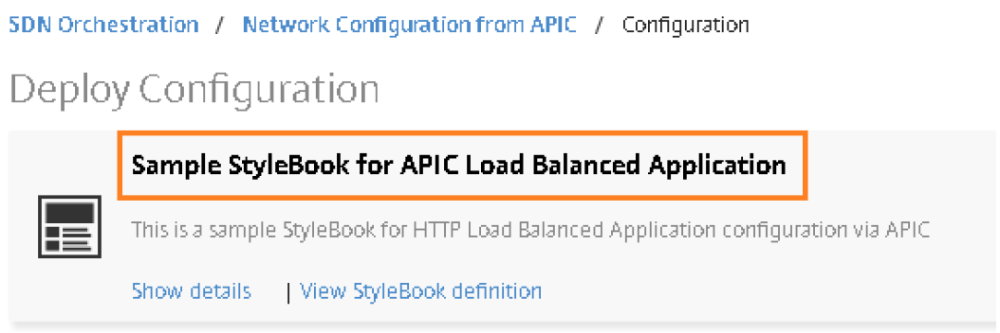

  * In the **Application Name** field, enter **WebGraph-VIP**.
 
  * Click **+** to add Services (ports) Settings.

   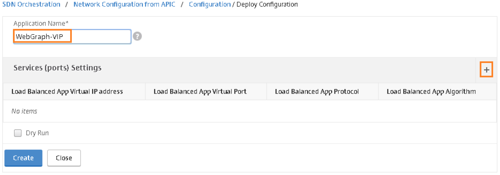

  * In the **Load Balanced App Virtual IP** address field, enter **10.10.10.100**.
 
  * In the **Server IPs** field enter **10.20.2.10**.
 
  * Click + to add another IP address and enter **10.20.2.11**.
 
  * Click **Create**.

   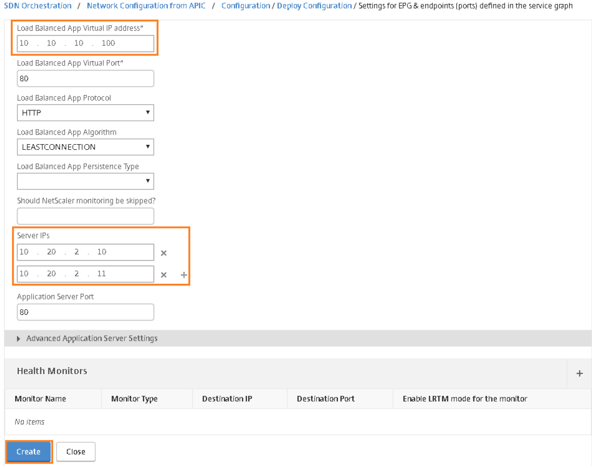
   
  * On the **Deploy Configuration** page, click **Create**.

   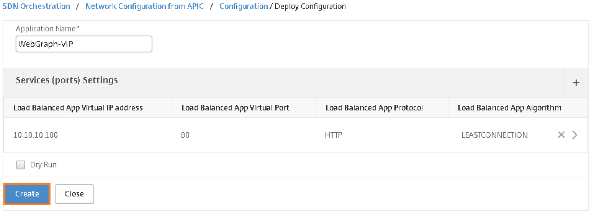

  * Watch the configuration dialog, then verify the Success messages, shown below.
 
   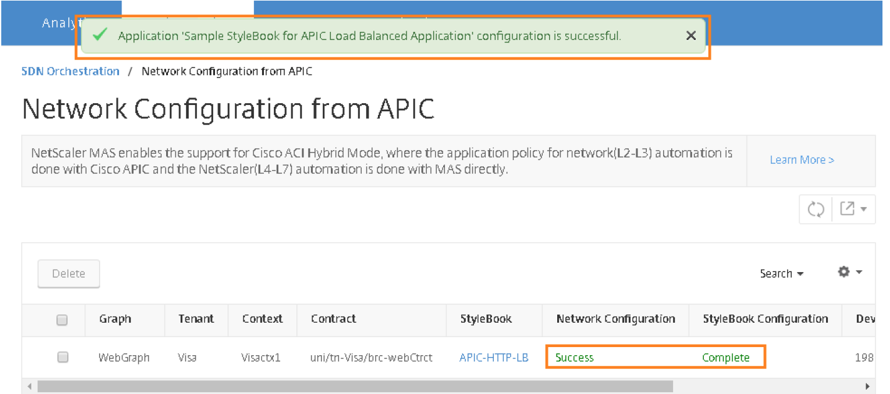

  * Click **APIC-HTTP-LB** to review the deployed settings or make changes.
 
  * Return to the **Citrix Netscaler VPX** browser tab. If necessary, log in again (**nsroot/C1sco12345**).

  * Expand **Traffic Management > Load Balancing** on the left menu and click Virtual Servers to display the **Virtual Server** created by the APIC. Click on the **Name** of the VIP to see additional deployed parameters.

   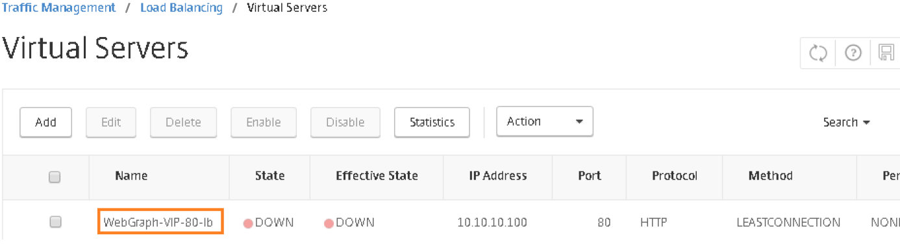

  * In the **Traffic Management > Load Balancing** menu, click **Service Groups** on the left menu, then click **WebGraph-VIP-80-sg**.

   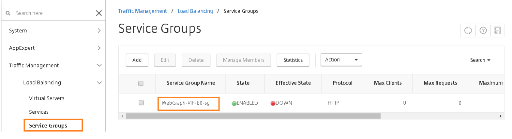

  * Click **2 Service Group Members** to display the pool of servers belonging to the Virtual Server created by **NetScaler MAS**.

   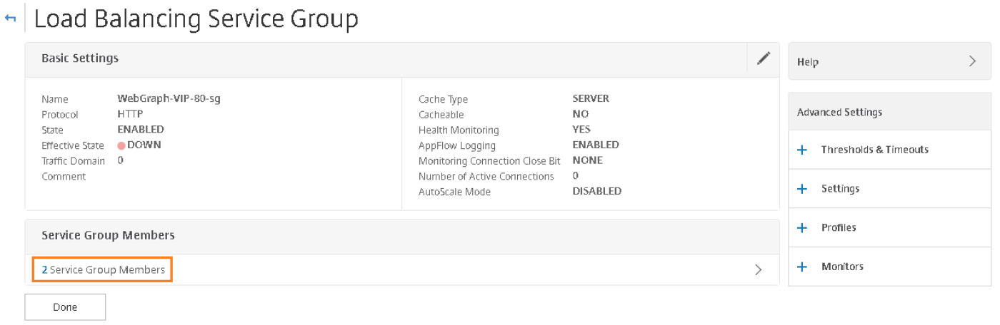

  * Review the list of servers that make up the service group.

30. [Remove the configuration and reset the environment](../Appendix/Appendix-A) prior to starting another scenario.
