# Building a Single Tenant with a Multi-Node Graph within the APIC using Service Manager mode via the Northbound API

The purpose of this scenario is to separate the L2-L3 and L4-L7 policy configuration, by using a preconfigured Python script to create **one tenant** with **one multi-node graph** within the APIC, and then using Citrix NetScaler MAS to configure the application policy.

> **NOTE:** If you have already run a scenario that created objects in the APIC, you must [remove those objects](../Scenario4) before running this
scenario.

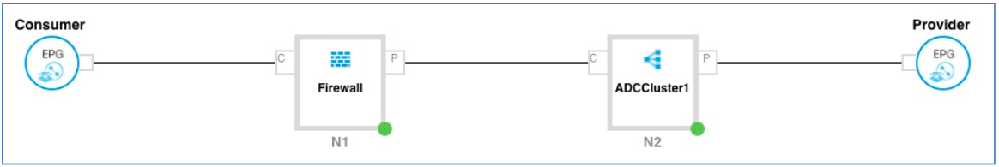

> **NOTE:** The Python script m ethod calls individual XML scripts to create a series of objects. To pause the script and create an object using an APIC wizard, see the instructions inline. Objects that can be created via wizard using this script are indicated with (*) in the list below.

## Python Script and Operations Overview

The Python script performs the following functions:

* Create a Tenant
* Im port Citrix NetScaler Hybrid Mode Device Package and Cisco ASAv Device Package
* Create L4-L7 Device Manager
* Create L4-L7 Device Cluster
    * Create Concrete Device
    * Create Logical Interfaces
    * Connect Interfaces of Logical to Concrete Device
* Create the Application Profile
* Create the Security Contract
* Create the Service Graph
* Attach Service Graph to Contract

Use the **User Interfaces** of Cisco APIC, NetScaler VPX, and NetScaler MAS to confirm deployed settings:

* View VLAN’s in APIC
* View Load Balancing Virtual Server and VLAN’s in NetScaler VPX
* View Port Group mappings for ASAv in VMware vCenter
* View Port Group mappings for VPX
* Verify MAC addresses for both VPX and ASAv in VMware vCenter
* Deploy L4-L7 WebGraph parameters in NetScaler MAS
* Verify deployed L4-L7 parameters in NetScaler MAS and in NetScaler VPX

| **Methods** | **Automation Level** | **Explanation** | **Completion Time** | **Notes** |
| ----------- |:--------------------:|:---------------:|:--------------------:|:--------:|
| Manual Configuration of Individual Objects | Low | Use an APIC wizard and the configuration parameters provided in this script to manually create each required object | 60 minutes | See the links in each step to the procedure for manual object creation. |
| Use Python Scripting to Build Objects Within the APIC | High | To configure the APIC objects with scripts, the user downloads a set of configuration scripts and employs them in a command window, monitoring the output via the APIC UI. | 20 minutes | To maximize the effectiveness of this Scenario, view the relevant directories in APIC while the Python scripts are working, to show the discovery of the network objects in real-time.

## Steps

1. From the demonstration workstation, click the APIC Login shortcut to open the **Application Policy Infrastructure Controller** window. Log in ( **admin** / **C1sco12345** ).

2. Double-click the **Cisco ASDM-IDM** icon to open the ASDM home page.

3. Click **Continue** at the Security Warning, and log in ( **admin/C1sco12345** ).
  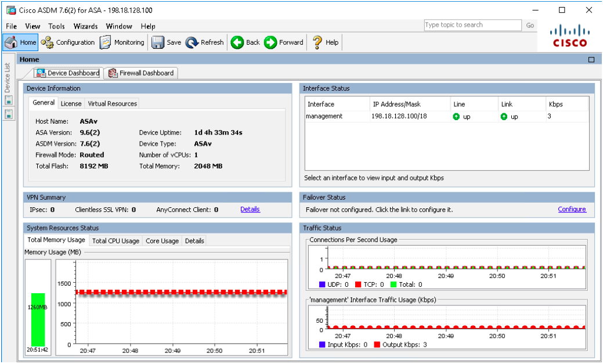

4. Minimize the ASDM window.

5. Click the PuTTY shortcut in the Windows taskbar to open the application.

6. Double-click **Tools** to load the stored session.
  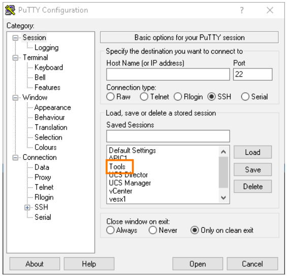

7. Log in to PuTTy ( **user01/user01** ).

8. Place the window so that both the PuTTY window and the APIC directories are visible.
  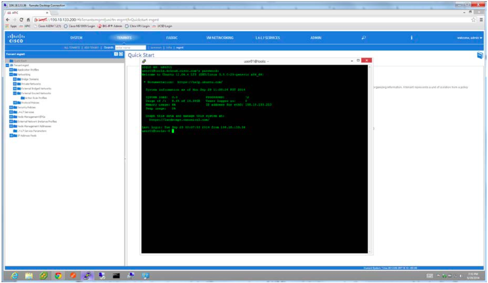

9. From the command line type **./request.py Citrix_Scripts/Build_ASA_Citrix_MAS.cfg** and hit **<Enter>**.
    
    > **NOTE:** To show the XML code as the Python script calls each XML script, substitute `./xml_request.py Citrix_Scripts/Build_ASA_Citrix_MAS.cfg` for the above command. This is an example of the partial XML output fo    the **Build_ASA_Citrix_MAS.xml** script.
        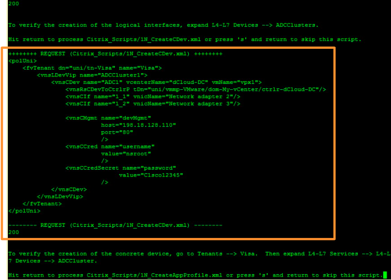
    
    The **Build_ASA_Citrix_MAS.cfg** script utilizes a series of XML scripts to perform the necessary configuratio  steps. It will pause between each of the XML scripts, and the user can either press < **Enter** > to run the script, or type **s** to skip the script and configure the object via a wizard. While the script is running, brief description will display what that script is doing, while the APIC window updates in real-time. When script completes successfully, the success code 200 will appear onscreen.
    
    ```
    [user01@rhel7-tools ~]$ ./xml_request.py Citrix_Scripts/Build_ASA_Citrix_MAS.cfg
    
    Hit return to process Citrix_Scripts/1N_Tenant.xml or press 's' and return to skip this script.
    
    ++++++++ REQUEST (Citrix_Scripts/2N_Tenant.xml) ++++++++ 
    <polUni>
        <fvTenant 
            dn="uni/tn-Visa"
            name="Visa">
        
            <fvCtx name="Visactx1"/>
        
            <!-- bridge domain --> 
            <fvBD name="VisaBDWeb">
                <fvRsCtx tnFvCtxName="Visactx1" />
                <fvSubnet ip="10.10.10.220/24"> 
                </fvSubnet>
            </fvBD>
        
            <!-- bridge domain --> 
            <fvBD name="VisaBDApp">
                <fvRsCtx tnFvCtxName="Visactx1" />
                <fvSubnet ip="192.168.10.220/24">
                </fvSubnet>
            </fvBD>
        
            <fvBD name="VisaBD3">
                <fvRsCtx tnFvCtxName="Visactx1" />
                <fvSubnet ip="30.30.30.220/24">
                </fvSubnet>
            </fvBD>
        </fvTenant>
    </polUni>
    
    --- REQUEST (Citrix_Scripts/2N_Tenant.xml) --------
    200
    
    To verify the creation of the tenant, go to Tenants and select Visa.
    ```

10. Create the **Tenant**.

    **a.** In the APIC top m enu, select **Tenants** to display the All Tenants list.

    **b.** Return to the PuTTY window and hit **< Enter >** at the **Hit return to process** `Citrix_Scripts/2N_Tenant.xml` or press **‘s’** and return to skip this script prompt. The **Visa** tenant is created and displayed in the window.

    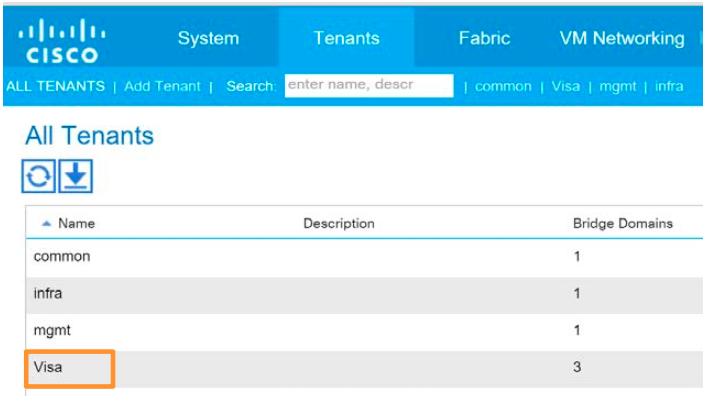

    **c.** Double-click the newly created Visa tenant.

    **d.** Expand the **Tenant Visa > Networking > Bridge Domains** directory to show that the **VisaBDApp, VisaBDWeb, and VisaBD3** bridge domains have been created.

    **e.** Expand the **Tenant Visa > Networking > VRFs** folder to show that the **Visactx1** private network has been created.

11. Import the Citrix Device Package and create the ADCCluster1 and Firewall Device Clusters as follows:

    **a.** From the top menu, select **L4-L7 Services**.

    **b.** From the top sub-menu, select **Packages**.

    **c.** Expand the **L4-L7 Service Device Types** folder and show that no packages are present.

    **d.** Return to the PuTTY window and hit **< Enter >** at the **Hit return to process `Citrix_Scripts/hybridModeDevicePackage-11.1-49.16.zip`** or press ‘**s**’ and return to skip this script prompt.

    **e.** Hit **< Enter >** at the Hit return to process `Citrix_Scripts/asa-device-pkg-1.2.7.8.zip` or press ‘**s**’ and return to skip this script prompt.

    **f.** The **CISCO-ASA-1.2** and **Citrix-NetScalerMAS-1.0** device packages appear in the **L4-L7 Services Device Types** directory.

    

    > NOTE: The next four steps create the device manager, device cluster, concrete devices and logical interfaces in the APIC. To [create these devices manually](../Appendix/Appendix-D), type s and < Enter > at the prompts for the following scripts:
    >      
      * `CreatedevMgr.xml`
      * `2N_CreateLDevVip_MAS.xml`
      * `2N_CreateCDev.xml`
      * `2N_CreateLIf_MAS.xml`

12. Create the **Device Manager** :

    **a.** Click **Tenants** in the top menu. If the **Visa** tenant screen is not displayed, double-click Visa in the Tenant List to display it.

    **b.** Expand **L4-L7 Services > Device Managers** and show there are no device managers present.

    **c.** Return to the PuTTY window and hit **< Enter >** at the `Hit return to process Citrix_Scripts/CreatedevMgr.xml` or press ‘**s**’ and return to skip this script prompt.

    **d.** Verify the creation of the **NetScaler-MAS** Device Manager.

13. Create the **Device Cluster** :

    **a.** Still in the Visa tenant window, expand L4-L7 Services > L4-L7 Devices , which is empty.
    
    **b.** Return to the PuTTY window and hit < Enter > at the `Hit return to process Citrix_Scripts/2N_CreateLDevVip_MAS.xml` or press '**s**' and return to skip this script prompt.

    **c.** Verify the creation of the **ADCCluster1** and **Firewall** device clusters.

14. Create the **Concrete Devices** for the **Visa** tenant as follows:

    **a.** Expand the **ADCCluster1** and **Firewall** directories.

    **b.** Return to the PuTTY window and hit **< Enter >** at the `Hit return to process Citrix_Scripts/2N_CreateCDev.xml` or press ‘**s**’ and return to skip this script prompt.

    **c.** The ADC1 device is created in the ADCCluster1 device cluster. Expand the ADC1 device to display the concrete interfaces.

    **d.** The **Firewall_Device_1** device is created in the **Firewall** device cluster.

    **e.** Expand the **ADC1** and **Firewall_Device_1** folders to display the concrete interfaces.

    **f.** Click ADCCluster1, then Firewall, to display the device state.
        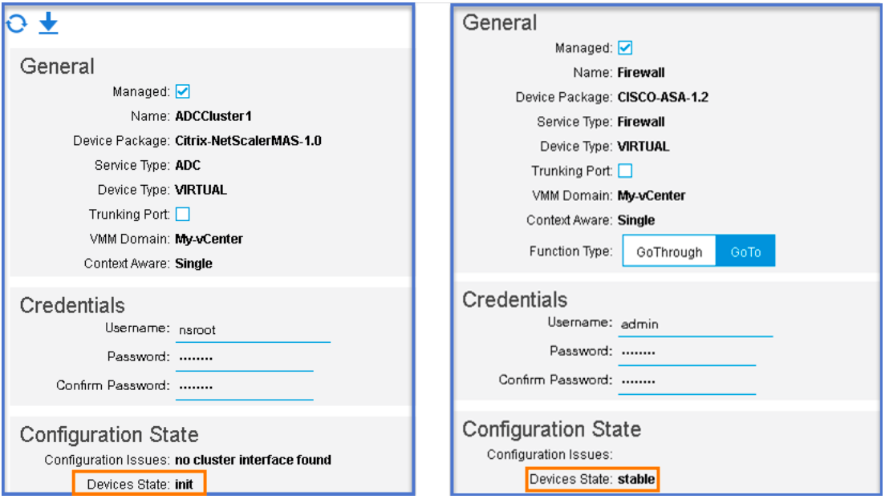

    > **NOTE:** The ADCCluster1 device will remain in **init** state until the interfaces are created in Step 15. Continue with the demo and, if desired, come back to check the status at the completion of the scenario.

15. Create the logical interfaces:

    **a.** Still in **TENANTS > Visa** , expand **L4-L7 Services** and select **ADCCluster**.

    **b.** Return to the PuTTY window and hit **< Enter >** at the `Hit return to process Citrix_Scripts/2N_CreateLIf_MAS.xml` or press ‘**s**’ and return to skip this script prompt.

16. **ADCCluster1** and **Firewall** are populated with inside and outside Logical Interfaces.

17. Connect the interfaces of the Logical and Concrete Device:

    **a.** Still in **TENANTS > Visa** , expand **L4-L7 Services** and select **ADCCluster**.
    
    **b.** Return to the PuTTY window and hit **< Enter >** at the `Hit return to process Citrix_Scripts/2N_CreateCDev.xml` or press ‘**s**’ and return to skip this script prompt.

    **c.** **ADCCluster1** and **Firewall** are populated with inside and outside Logical Interfaces.

18. Create the Application Profile as follows:

    **a.** Still in the **Tenant Visa** directory, expand **Application Profiles**, which is empty.
    
    **b.** Return to the PuTTY window and hit **< Enter >** at the `Hit return to Process Citrix_Scripts/2N_CreateAppProfile_MAS.xml` or press ‘**s**’ and return to skip this script prompt.

    **c.** The **SAP** application profile drops into the directory as it is created. Expand the Application EPGs directory to view the EPGs – **EPG SAPApp** and **EPG SAPWeb**.

19. Verify the VM Domains are formed to the EPG as follows:

    Expand each EPG **SAPApp** and **SAPWeb** in turn and click **Domains (VMs and Bare-Metals)** to see that the **State** of My-vCenter and Phys is **formed**.
    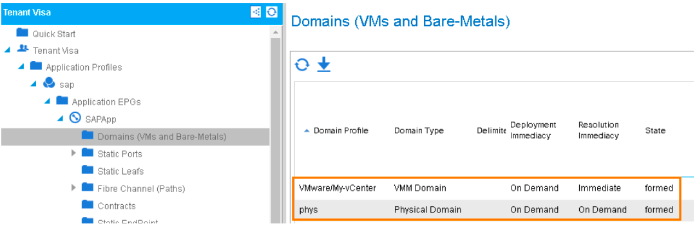

20. Create the contracts as follows:

    **a.** Expand **Security Policies > Contracts**.

    **b.** Return to the PuTTY window and hit **< Enter >** at the `Hit return to Process Citrix_Scripts/2N_CreateContract.xml` or press ‘**s**’ and return to skip this script prompt.

    **c.** **webCtrct > http** is created in **Contracts**.

21. Create the WebGraph **Service Graph** as follows:

    **a.** Still in **TENANTS > Visa** , expand **L4-L7 Services > L4-L7 Service Graph Templates**, which is empty.
    
    **b.** Return to the PuTTY window and hit **< Enter >** at the `Hit return to process Citrix_Scripts/2N_CreateGraph_MAS.xml` or press ‘**s**’ and return to skip this script prompt.

    **c.** **WebGraph** is created in the **L4-L7 Service Graph Templates** folder, with **Function Node – N1**, and **Function Node - N2** sub-directories. This script also pushes the Port Profiles.

    **d.** Click **WebGraph** to show the topology of the Service Graph Template.
    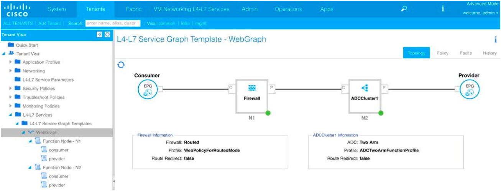

22. Optional – Click each **Function Node** to show all the parameters that have been configured.

    > **NOTE:** The next step runs the script that attaches the Service Graph to the Contract. To [perform the procedure manually](../Appendix/Appendix-E), type **s** at the prompts for the **Citrix_Scripts/2N_AttachGraphToContract.xml** script:

23. Attach the **Service Graphs** to the **Visa** tenant, as follows:

    **a.** Still in the **Tenants > Visa**, directory, expand **L4-L7 Services > Deployed Graph Instances**, which is empty.

    **b.** Return to the PuTTY window and hit **< Enter >** at the `Hit return to process Citrix_Scripts/2N_AttachGraphToContract.xml` or press ‘**s**’ and return to skip this script prompt.

    **c.** Allow a few seconds for the script to finish. **webCtrct-WebGraph-Visa** drops into the **Deployed Graph Instances** directory, showing the association.

24. Click the **L4-L7 Services > Deployed Graph Instances** folder – the contract is listed in applied state.
    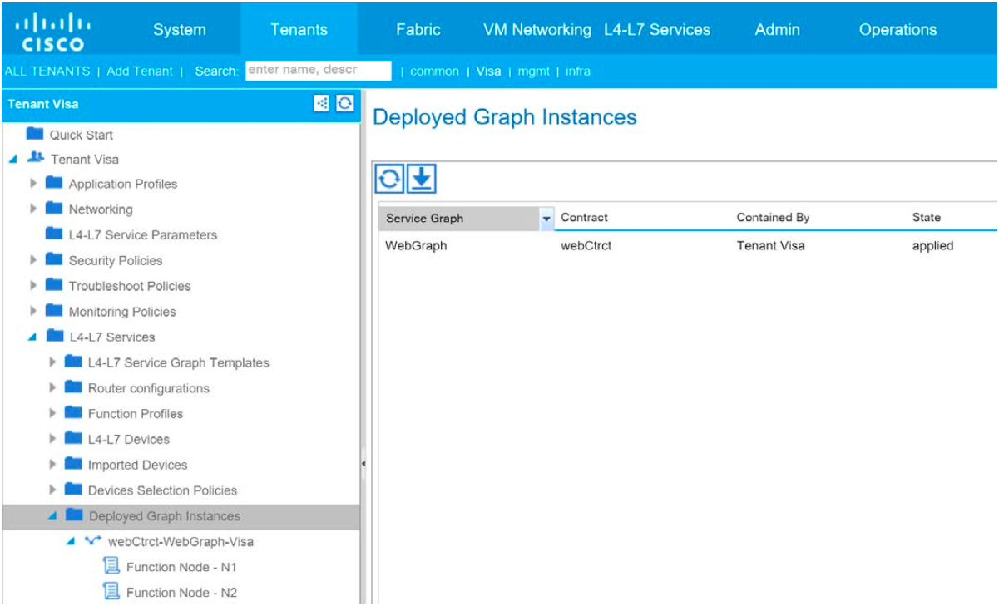

25. Click **webCtrct-WebGraph-Visa** to see the topology of the deployed Service Graph.
    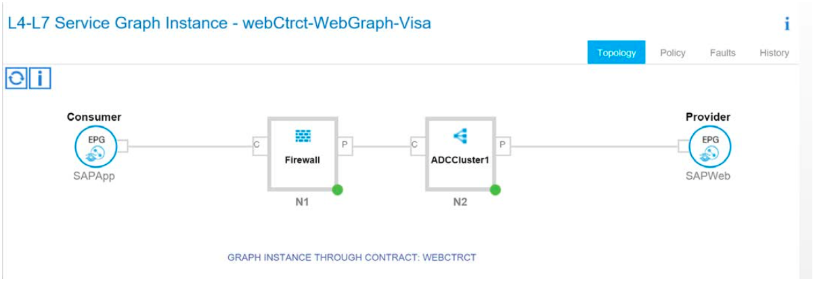

26. Expand **Deployed Devices** , and click **ADCCluster1-visactx1** and **Firewall-visactx1** in turn to review the VLANs allocated.
    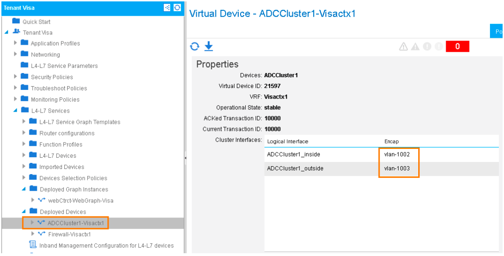

27. Open a new **Chrome** tab. In the **Chrome Bookmarks Toolbar** , click the **NetScaler VPX** shortcut and login with credentials **nsroot/C1sco**.

28. Expand **System > Network** on the left menu and click **VLANs** to display the VLANs. Verify that the VLANs match the ones showing in the ADCCluster1-Visactx1 device in APIC.

    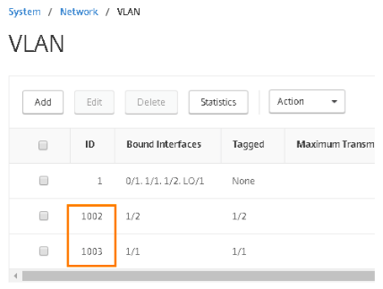

29. Click the vSphere shortcut in the task bar, and log in to vSphere. (No login credentials are needed – click **Login** ) Navigate to the Networking window and verify the creation of the additional Port-Profiles.

    

30. In the Location bar, click **Networking** and select **Hosts and Clusters** from the drop-down.

    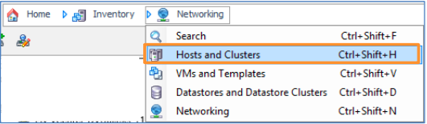

31. Click **vpx**.


32. Click **Edit Settings** to bring up the **Parameters** configuration window, open to the **Hardware** tab. (Click OK in the pop-up, the warning message can be ignored.)

    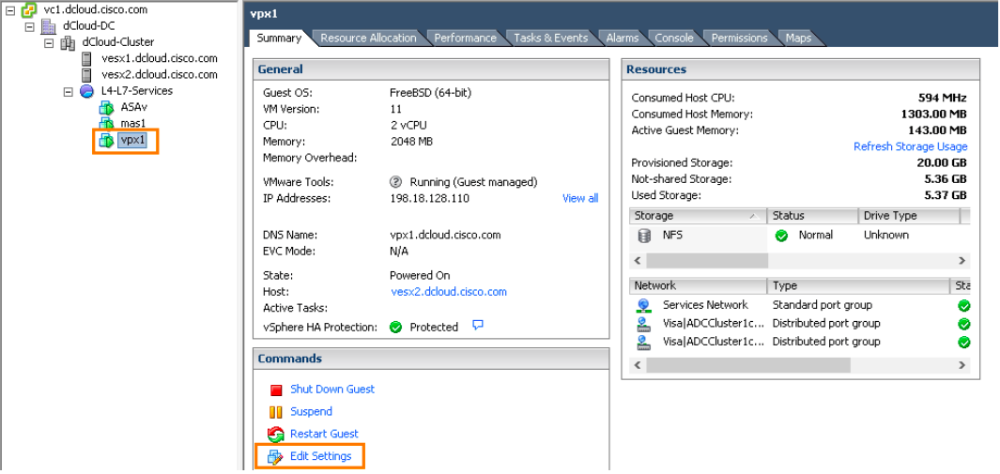

33. Click **Network adapter 2** and **Network adapter 3** in turn. Note the displayed MAC addresses, and compare them to those in the APIC during the following steps.

    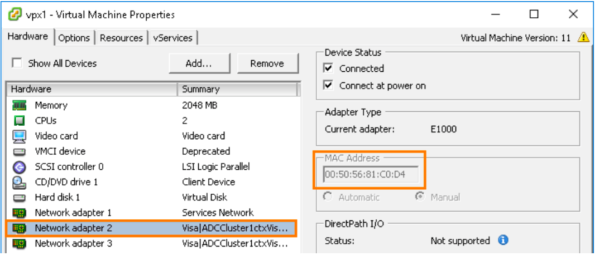

34. Close the **Virtual Machine Properties** window.

35. Click **ASAv** and repeat Steps 31-34, making note of the MAC Addresses of the ASAv network adapters.

36. Verify that the MAC addresses and PORTGROUP show in the APIC window:

    **a.** From the **VM NETWORKING > Inventory menu**, expand **VMware > My-vCenter > Controllers > dCloudDC > Hypervisors > vesx1.dcloud.cisco.com > Virtual Machines** and **vesx2.dcloud.cisco.com > Virtual Machines**. *(vpx1 may be running on either host.)*

    **b.** Click vpx1 to display its parameters. Verify that the MAC addresses and portgroups match those in vSphere.

    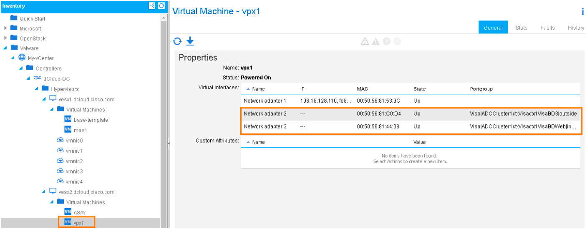

37. Click **ASAv** to display its parameters. Verify that the MAC addresses and portgroups match those in vSphere.

    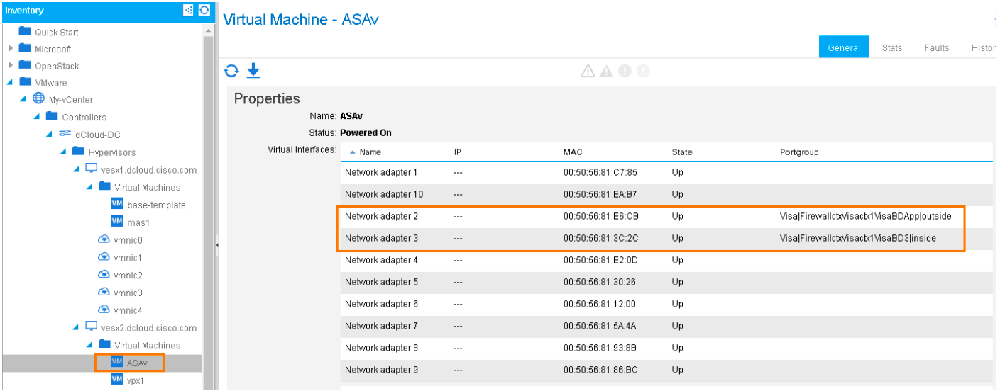

38. Return to the ASA ADSM console to see the additional interface created. If it does not appear within a few seconds, click Refresh.
    
    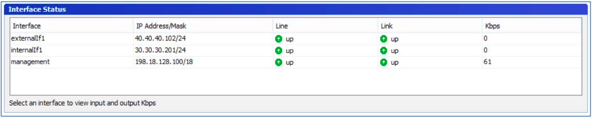

39. Open a new **Chrome** tab. In the Chrome Bookmarks Toolbar, click the **NetScaler MAS** shortcut and log in ( **nsroot/C1sco12345** ).

40. In the top menu, click **Orchestration**.

41. In the left menu click **SDN Orchestration** , and then click **Cisco ACI**.

42. In the center frame, click **APIC-HTTP-LB.**
    
    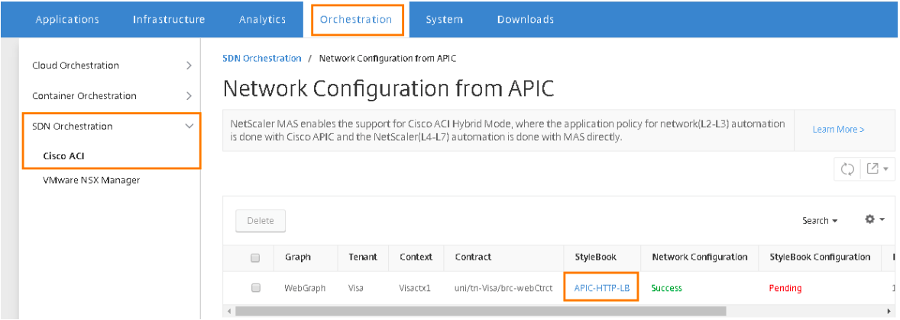

43. On the Deploy Configuration page, click **Sample StyleBook for APIC Load Balanced Application**.
    
    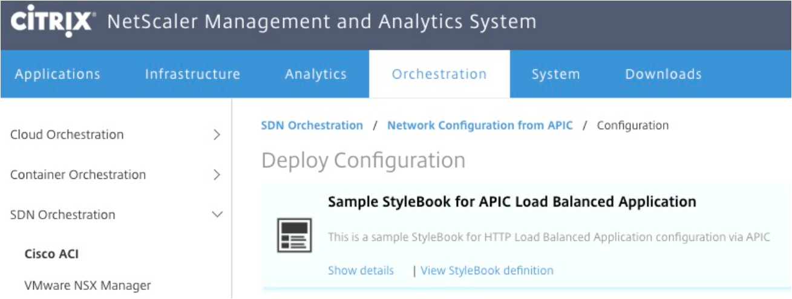

44. In the field **Application Name** , enter **WebGraph-VIP**.

45. Click **+** to add **Services (ports) Settings**.
    
    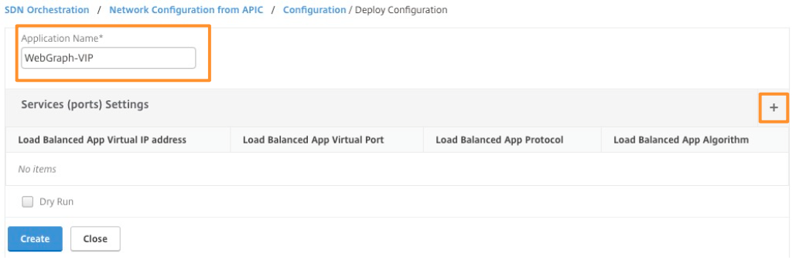

46. Enter **10.10.10.100** in the **Load Balanced App Virtual IP address** field.

47. Enter **10.20.2.10** in the **Server IPs** field, then click **+** to the left of the field. In the new field directly below, enter **10.20.2.11**, then click **Create**.
    
    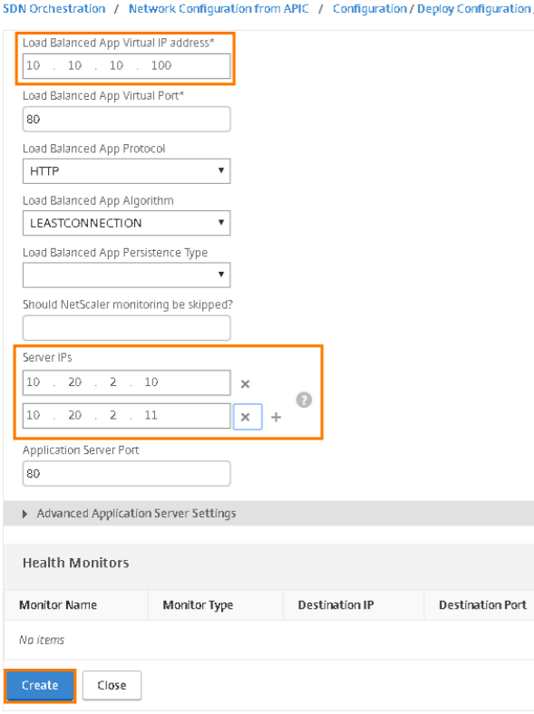

48. On the Deploy Configuration page, click Create.
    
    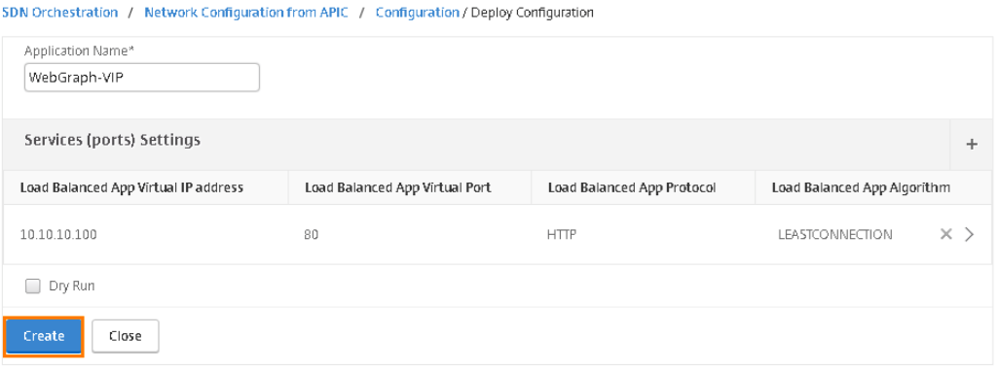

49. Watch the configuration dialogue, then verify the Deployed L4-L7 Parameters in NetScaler MAS.
    
    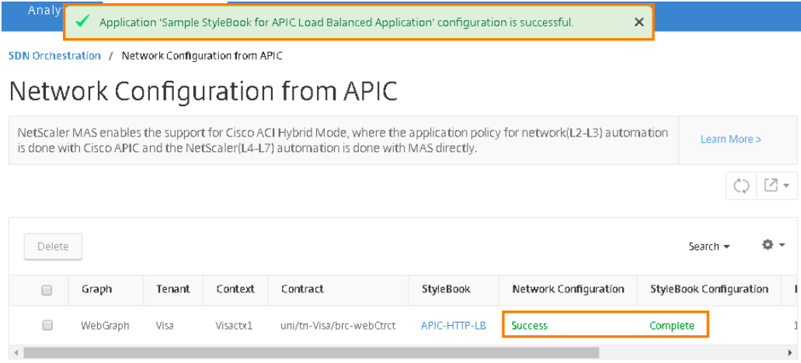

50. Return to the **Citrix Netscaler VPX** browser tab, or open a new one if one is not open.

51. Expand **Traffic Management > Load Balancing** in the side menu and click **Virtual Server** to display the Virtual Server created by NetScaler MAS.

    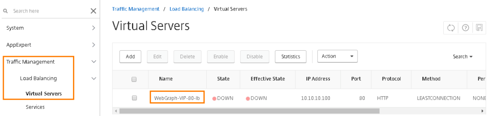

52. Click **Service Groups** on the left menu, then click **WebGraph-VIP- 80 - sg.**

    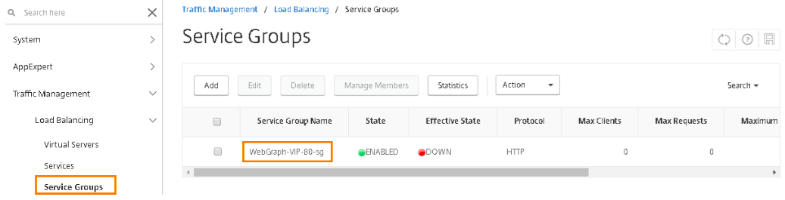

53. Click **2 Service Group Members** to display the pool of servers belonging to the Virtual Server created by NetScaler MAS.
    
    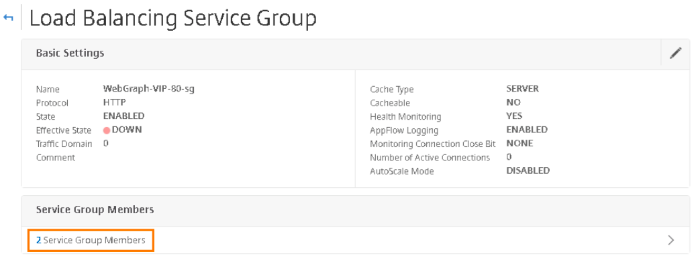

54. Review the server pool members.

    

55. Remove the configuration and [reset the environment](../Appendix/Appendix-A) prior to starting another scenario.